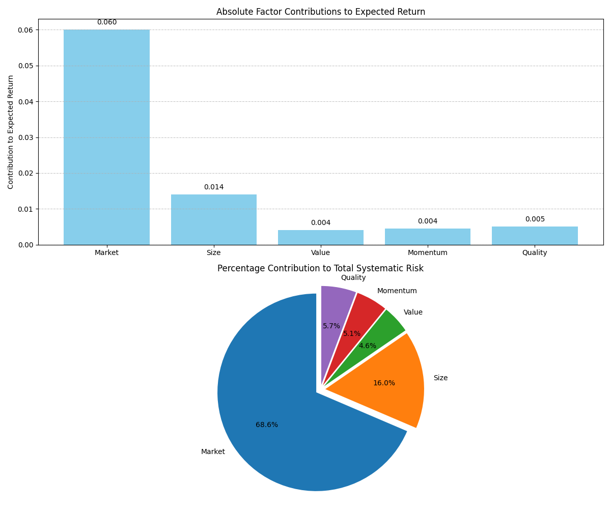
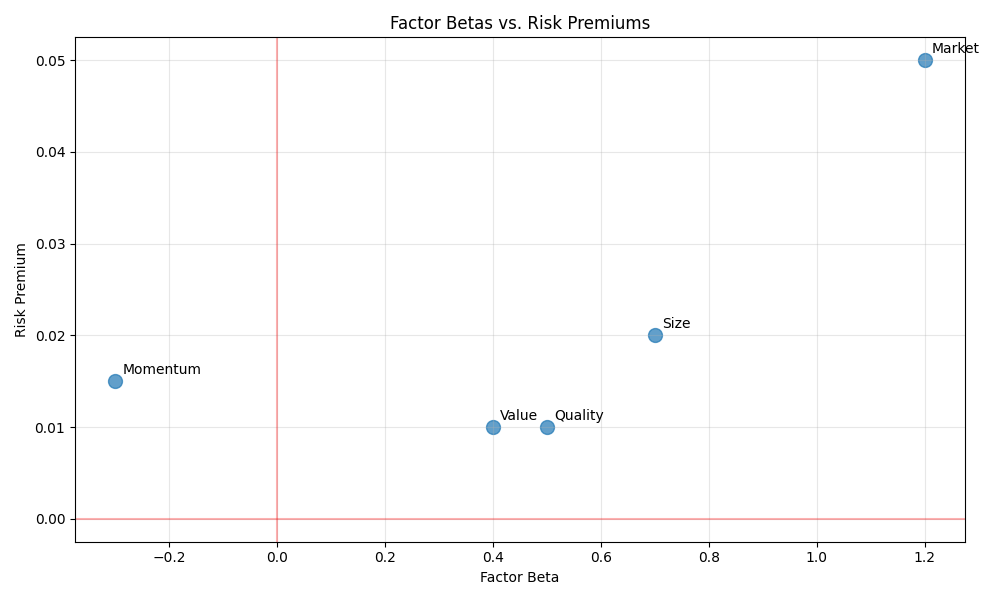
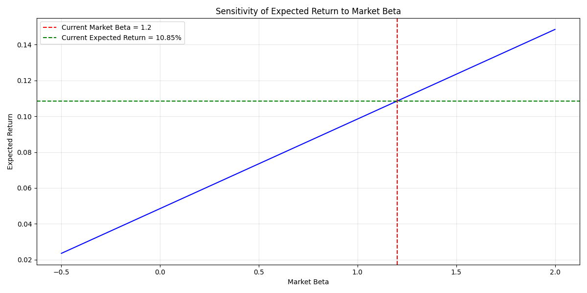

# Arbitrage Pricing Theory (APT)

The `apt` function implements the Arbitrage Pricing Theory model, which is a multi-factor model for calculating expected returns on assets. Unlike the single-factor CAPM, APT allows for multiple sources of systematic risk to influence asset returns.

## Usage in Pypulate

```python
from pypulate.asset import apt

# Calculate expected return using APT with three factors
result = apt(
    risk_free_rate=0.03,                   # 3% risk-free rate
    factor_betas=[0.8, 0.5, 0.3],          # Beta coefficients for each factor
    factor_risk_premiums=[0.04, 0.02, 0.01] # Risk premiums for each factor
)

# Access the results
expected_return = result["expected_return"]
risk_assessment = result["risk_assessment"]
factor_details = result["factor_details"]

print(f"Expected Return: {expected_return:.2%}")  # 7.30%
```

## Parameters

| Parameter | Type | Description | Default |
|-----------|------|-------------|---------|
| `risk_free_rate` | float | Risk-free rate of return (e.g., 0.03 for 3%) | Required |
| `factor_betas` | list of float | Beta coefficients for each factor | Required |
| `factor_risk_premiums` | list of float | Risk premiums for each factor | Required |

## Return Value

The function returns a dictionary with the following keys:

| Key | Type | Description |
|-----|------|-------------|
| `expected_return` | float | Expected return calculated using the APT model |
| `risk_free_rate` | float | Risk-free rate used in the calculation |
| `total_systematic_risk` | float | Sum of absolute factor contributions to risk |
| `risk_assessment` | str | Qualitative assessment of the total systematic risk |
| `factor_details` | list of dict | Detailed information about each factor's contribution |

## Risk Level Classification

The total systematic risk is categorized into risk levels:

| Total Systematic Risk | Risk Assessment |
|-----------------------|-----------------|
| < 0.02 | Low risk |
| 0.02 - 0.04 | Moderate risk |
| 0.04 - 0.06 | Above-average risk |
| > 0.06 | High risk |

## Comprehensive Example

Here's a complete example demonstrating how to use the APT model for asset pricing and analyzing factor contributions:

```python
from pypulate.asset import apt
import matplotlib.pyplot as plt
import numpy as np

# Define factors for analysis
factor_names = ["Market", "Size", "Value", "Momentum", "Quality"]
factor_betas = [1.2, 0.7, 0.4, -0.3, 0.5]
factor_risk_premiums = [0.05, 0.02, 0.01, 0.015, 0.01]
risk_free_rate = 0.03

# Calculate expected return using APT
result = apt(
    risk_free_rate=risk_free_rate,
    factor_betas=factor_betas,
    factor_risk_premiums=factor_risk_premiums
)

# Print the results
print("Arbitrage Pricing Theory Analysis")
print("================================")
print(f"Expected Return: {result['expected_return']:.2%}")
print(f"Total Systematic Risk: {result['total_systematic_risk']:.2%}")
print(f"Risk Assessment: {result['risk_assessment']}")

# Print factor contributions
print("\nFactor Contributions:")
print(f"{'Factor':<10} {'Beta':<8} {'Risk Premium':<15} {'Contribution':<15} {'% of Total':<12}")
print("-" * 60)

for i, factor in enumerate(result['factor_details']):
    print(f"{factor_names[i]:<10} {factor['beta']:>+.2f}    {factor['risk_premium']:>6.2%}         {factor['contribution']:>+.4f}         {factor['contribution_pct']:>6.1%}")

# Calculate absolute contributions for visualization
abs_contributions = [abs(factor['contribution']) for factor in result['factor_details']]
contribution_pcts = [factor['contribution_pct'] for factor in result['factor_details']]

# Visualize factor contributions
plt.figure(figsize=(12, 10))

# Create a subplot for absolute contributions
plt.subplot(2, 1, 1)
bars = plt.bar(factor_names, abs_contributions, color='skyblue')
plt.title('Absolute Factor Contributions to Expected Return')
plt.ylabel('Contribution to Expected Return')
plt.grid(axis='y', linestyle='--', alpha=0.7)

# Add value labels on top of bars
for bar in bars:
    height = bar.get_height()
    plt.text(bar.get_x() + bar.get_width()/2., 
             height + 0.001,
             f'{height:.3f}', 
             ha='center', va='bottom')

# Create a subplot for percentage contributions
plt.subplot(2, 1, 2)
plt.pie(contribution_pcts, labels=factor_names, autopct='%1.1f%%', 
        startangle=90, shadow=False, explode=[0.05] * len(factor_names))
plt.axis('equal')  # Equal aspect ratio ensures that pie is drawn as a circle
plt.title('Percentage Contribution to Total Systematic Risk')

plt.tight_layout()
plt.show()

# Visualize factor betas vs. risk premiums
plt.figure(figsize=(10, 6))
plt.scatter(factor_betas, factor_risk_premiums, s=100, alpha=0.7)

# Add factor labels
for i, name in enumerate(factor_names):
    plt.annotate(name, (factor_betas[i], factor_risk_premiums[i]), 
                 xytext=(5, 5), textcoords='offset points')

plt.axhline(y=0, color='r', linestyle='-', alpha=0.3)
plt.axvline(x=0, color='r', linestyle='-', alpha=0.3)
plt.title('Factor Betas vs. Risk Premiums')
plt.xlabel('Factor Beta')
plt.ylabel('Risk Premium')
plt.grid(True, alpha=0.3)
plt.tight_layout()
plt.show()

# Sensitivity analysis: Impact of changing factor betas
plt.figure(figsize=(12, 6))

# Create range of beta values for sensitivity analysis
beta_range = np.linspace(-0.5, 2.0, 100)
expected_returns = []

# Choose a factor to analyze (e.g., Market factor)
factor_index = 0
original_beta = factor_betas[factor_index]

# Calculate expected returns for different beta values
for beta in beta_range:
    # Create a copy of factor betas and modify the selected factor
    modified_betas = factor_betas.copy()
    modified_betas[factor_index] = beta
    
    # Calculate expected return with modified beta
    modified_result = apt(
        risk_free_rate=risk_free_rate,
        factor_betas=modified_betas,
        factor_risk_premiums=factor_risk_premiums
    )
    
    expected_returns.append(modified_result['expected_return'])

# Plot sensitivity analysis
plt.plot(beta_range, expected_returns, 'b-')
plt.axvline(x=original_beta, color='r', linestyle='--', 
            label=f'Current {factor_names[factor_index]} Beta = {original_beta}')
plt.axhline(y=result['expected_return'], color='g', linestyle='--',
            label=f'Current Expected Return = {result["expected_return"]:.2%}')
plt.title(f'Sensitivity of Expected Return to {factor_names[factor_index]} Beta')
plt.xlabel(f'{factor_names[factor_index]} Beta')
plt.ylabel('Expected Return')
plt.grid(True, alpha=0.3)
plt.legend()
plt.tight_layout()
plt.show()
```

## Example Output

```
Arbitrage Pricing Theory Analysis
================================
Expected Return: 10.85%
Total Systematic Risk: 8.75%
Risk Assessment: High risk
Factor Contributions:
Factor     Beta     Risk Premium    Contribution    % of Total  
------------------------------------------------------------
Market     +1.20     5.00%         +0.0600          68.6%
Size       +0.70     2.00%         +0.0140          16.0%
Value      +0.40     1.00%         +0.0040           4.6%
Momentum   -0.30     1.50%         -0.0045           5.1%
Quality    +0.50     1.00%         +0.0050           5.7%
```

## Visualizations

### Factor Contributions to Expected Return

This visualization shows the absolute contribution of each factor to the expected return. Larger contributions indicate factors with greater impact on the asset's expected return.




### Percentage Contribution to Total Systematic Risk

This pie chart illustrates the relative importance of each factor in contributing to the total systematic risk of the asset.

### Factor Betas vs. Risk Premiums

This scatter plot shows the relationship between factor betas and risk premiums, helping to identify which factors have both high sensitivity (beta) and high compensation (risk premium).




### Sensitivity Analysis

This line chart demonstrates how changes in a specific factor's beta affect the overall expected return, allowing for risk management and scenario analysis.




## Practical Applications

The Arbitrage Pricing Theory model is used for:

1. **Asset Pricing**: Determining the fair value of assets based on their exposure to multiple risk factors
2. **Portfolio Construction**: Building portfolios with targeted exposures to specific risk factors
3. **Risk Management**: Identifying and managing exposure to various systematic risk factors
4. **Performance Attribution**: Analyzing the sources of portfolio returns across different risk factors
5. **Investment Strategy Development**: Creating factor-based investment strategies

## Methodological Considerations

When applying the APT model, several methodological issues should be considered:

1. **Factor Selection**: Choosing relevant and independent risk factors that explain asset returns
2. **Beta Estimation**: Methods for estimating factor betas (e.g., regression analysis, fundamental analysis)
3. **Risk Premium Estimation**: Approaches for determining factor risk premiums (historical averages, forward-looking estimates)
4. **Model Specification**: Determining the appropriate number of factors to include in the model
5. **Time Horizon**: Considering the time horizon for factor exposures and expected returns

## Limitations

The Arbitrage Pricing Theory model has several limitations:

1. **Factor Identification**: The theory doesn't specify which factors to include
2. **Estimation Uncertainty**: Factor betas and risk premiums are subject to estimation error
3. **Time Variation**: Factor exposures and risk premiums may change over time
4. **Model Risk**: The model assumes linear relationships between factors and returns
5. **Data Requirements**: Requires substantial data for reliable factor identification and beta estimation
``` 