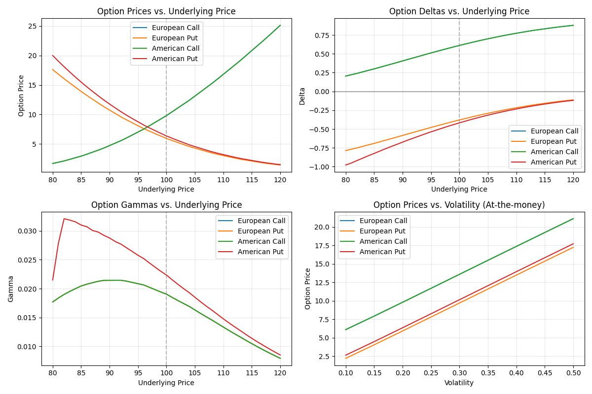

# Binomial Tree Option Pricing Model

The `binomial_tree` function implements a flexible binomial tree model for option pricing, supporting both European and American options (calls and puts). This model discretizes time to expiration into multiple steps and models the evolution of the underlying asset price as a binomial process.

## Usage in Pypulate

```python
from pypulate.asset import binomial_tree

# Calculate price for an American put option
result = binomial_tree(
    option_type='american_put',
    underlying_price=100,
    strike_price=100,
    time_to_expiry=1.0,
    risk_free_rate=0.05,
    volatility=0.2,
    steps=50,
    dividend_yield=0.01
)

# Access the results
option_price = result["price"]
delta = result["delta"]
gamma = result["gamma"]
early_exercise = result["early_exercise_optimal"]

print(f"Option Price: ${option_price:.2f}")
print(f"Delta: {delta:.4f}")
print(f"Gamma: {gamma:.6f}")
print(f"Early Exercise Optimal: {early_exercise}")
```

## Parameters

| Parameter | Type | Description | Default |
|-----------|------|-------------|---------|
| `option_type` | str | Type of option ('european_call', 'european_put', 'american_call', 'american_put') | Required |
| `underlying_price` | float | Current price of the underlying asset | Required |
| `strike_price` | float | Strike price of the option | Required |
| `time_to_expiry` | float | Time to expiration in years | Required |
| `risk_free_rate` | float | Risk-free interest rate (annualized) | Required |
| `volatility` | float | Volatility of the underlying asset (annualized) | Required |
| `steps` | int | Number of time steps in the binomial tree | 100 |
| `dividend_yield` | float | Continuous dividend yield | 0.0 |

## Return Value

The function returns a dictionary with the following keys:

| Key | Type | Description |
|-----|------|-------------|
| `price` | float | Calculated option price |
| `delta` | float | Option delta (first derivative with respect to underlying price) |
| `gamma` | float | Option gamma (second derivative with respect to underlying price) |
| `underlying_price` | float | Price of the underlying asset used in calculation |
| `strike_price` | float | Strike price used in calculation |
| `time_to_expiry` | float | Time to expiration used in calculation |
| `risk_free_rate` | float | Risk-free rate used in calculation |
| `volatility` | float | Volatility used in calculation |
| `steps` | int | Number of steps used in the binomial tree |
| `dividend_yield` | float | Dividend yield used in calculation |
| `up_factor` | float | Upward movement factor in the binomial tree |
| `down_factor` | float | Downward movement factor in the binomial tree |
| `risk_neutral_probability` | float | Risk-neutral probability of an upward movement |
| `early_exercise_optimal` | bool | Whether early exercise is optimal (for American options only) |

## Risk Level Classification

Option pricing models can be classified based on their volatility input:

| Volatility Range | Risk Assessment |
|------------------|-----------------|
| < 0.15 | Low volatility |
| 0.15 - 0.25 | Moderate volatility |
| 0.25 - 0.35 | High volatility |
| > 0.35 | Very high volatility |

## Comprehensive Example

Here's a complete example demonstrating how to use the binomial tree model for option pricing and analysis:

```python
import numpy as np
import matplotlib.pyplot as plt
from pypulate.asset import binomial_tree

# Define option parameters
underlying_prices = np.linspace(80, 120, 41)  # Range of underlying prices
strike_price = 100
time_to_expiry = 1.0
risk_free_rate = 0.05
volatility = 0.2
steps = 100
dividend_yield = 0.01

# Calculate option prices for different option types
option_types = ['european_call', 'european_put', 'american_call', 'american_put']
option_prices = {option_type: [] for option_type in option_types}
option_deltas = {option_type: [] for option_type in option_types}
option_gammas = {option_type: [] for option_type in option_types}

for price in underlying_prices:
    for option_type in option_types:
        result = binomial_tree(
            option_type=option_type,
            underlying_price=price,
            strike_price=strike_price,
            time_to_expiry=time_to_expiry,
            risk_free_rate=risk_free_rate,
            volatility=volatility,
            steps=steps,
            dividend_yield=dividend_yield
        )
        option_prices[option_type].append(result['price'])
        option_deltas[option_type].append(result['delta'])
        option_gammas[option_type].append(result['gamma'])

# Visualize option prices
plt.figure(figsize=(12, 8))

# Plot option prices
plt.subplot(2, 2, 1)
for option_type in option_types:
    plt.plot(underlying_prices, option_prices[option_type], label=option_type.replace('_', ' ').title())
plt.axvline(x=strike_price, color='gray', linestyle='--', alpha=0.5)
plt.grid(True, alpha=0.3)
plt.xlabel('Underlying Price')
plt.ylabel('Option Price')
plt.title('Option Prices vs. Underlying Price')
plt.legend()

# Plot option deltas
plt.subplot(2, 2, 2)
for option_type in option_types:
    plt.plot(underlying_prices, option_deltas[option_type], label=option_type.replace('_', ' ').title())
plt.axvline(x=strike_price, color='gray', linestyle='--', alpha=0.5)
plt.axhline(y=0, color='black', linestyle='-', alpha=0.3)
plt.grid(True, alpha=0.3)
plt.xlabel('Underlying Price')
plt.ylabel('Delta')
plt.title('Option Deltas vs. Underlying Price')
plt.legend()

# Plot option gammas
plt.subplot(2, 2, 3)
for option_type in option_types:
    plt.plot(underlying_prices, option_gammas[option_type], label=option_type.replace('_', ' ').title())
plt.axvline(x=strike_price, color='gray', linestyle='--', alpha=0.5)
plt.grid(True, alpha=0.3)
plt.xlabel('Underlying Price')
plt.ylabel('Gamma')
plt.title('Option Gammas vs. Underlying Price')
plt.legend()

# Analyze impact of volatility on option price
volatilities = np.linspace(0.1, 0.5, 9)
vol_prices = {option_type: [] for option_type in option_types}

for vol in volatilities:
    for option_type in option_types:
        result = binomial_tree(
            option_type=option_type,
            underlying_price=strike_price,  # At-the-money
            strike_price=strike_price,
            time_to_expiry=time_to_expiry,
            risk_free_rate=risk_free_rate,
            volatility=vol,
            steps=steps,
            dividend_yield=dividend_yield
        )
        vol_prices[option_type].append(result['price'])

# Plot volatility impact
plt.subplot(2, 2, 4)
for option_type in option_types:
    plt.plot(volatilities, vol_prices[option_type], label=option_type.replace('_', ' ').title())
plt.grid(True, alpha=0.3)
plt.xlabel('Volatility')
plt.ylabel('Option Price')
plt.title('Option Prices vs. Volatility (At-the-money)')
plt.legend()

plt.tight_layout()
plt.show()

# Analyze early exercise boundary for American put
if dividend_yield > 0:
    print("\nAnalyzing early exercise boundary for American put with dividend yield...")
    times = np.linspace(0.1, 1.0, 10)
    early_exercise_boundary = []
    
    for t in times:
        # Binary search to find the critical stock price
        lower = 0.1 * strike_price
        upper = strike_price
        
        while upper - lower > 0.01:
            mid = (lower + upper) / 2
            result = binomial_tree(
                option_type='american_put',
                underlying_price=mid,
                strike_price=strike_price,
                time_to_expiry=t,
                risk_free_rate=risk_free_rate,
                volatility=volatility,
                steps=steps,
                dividend_yield=dividend_yield
            )
            
            if result['early_exercise_optimal']:
                lower = mid
            else:
                upper = mid
        
        early_exercise_boundary.append((lower + upper) / 2)
    
    # Plot early exercise boundary
    plt.figure(figsize=(10, 6))
    plt.plot(times, early_exercise_boundary, 'r-', linewidth=2)
    plt.axhline(y=strike_price, color='gray', linestyle='--', alpha=0.5)
    plt.grid(True, alpha=0.3)
    plt.xlabel('Time to Expiry (years)')
    plt.ylabel('Underlying Price')
    plt.title('Early Exercise Boundary for American Put Option')
    plt.show()
    
    print(f"Early Exercise Boundary at t=1.0: ${early_exercise_boundary[-1]:.2f}")
```

## Example Output

```
Analyzing early exercise boundary for American put with dividend yield...
Early Exercise Boundary at t=1.0: $80.18
```

## Visualizations

### Option Prices vs. Underlying Price

This chart shows how option prices change with the underlying asset price for different option types. American options are typically more valuable than their European counterparts due to the early exercise feature.



### Option Greeks

The Delta and Gamma charts illustrate how these risk measures change with the underlying price:

- **Delta**: Represents the rate of change of the option price with respect to changes in the underlying asset's price
- **Gamma**: Measures the rate of change in Delta with respect to changes in the underlying price


### Volatility Impact

This chart demonstrates how increasing volatility affects option prices. Generally, higher volatility increases option prices for both calls and puts.


### Early Exercise Boundary

For American put options with dividend-paying stocks, this chart shows the critical stock price below which early exercise becomes optimal.


## Theoretical Background

The binomial tree model is based on the following assumptions:

1. The underlying asset price follows a binomial process
2. Markets are frictionless (no transaction costs or taxes)
3. Risk-free borrowing and lending is possible
4. No arbitrage opportunities exist

The model discretizes time into small intervals and assumes that at each time step, the price can either move up by a factor `u` or down by a factor `d` with risk-neutral probabilities `p` and `1-p` respectively.

The key parameters of the model are calculated as:

- Up factor: $u = e^{\sigma\sqrt{\Delta t}}$
- Down factor: $d = 1/u$
- Risk-neutral probability: $p = \frac{e^{(r-q)\Delta t} - d}{u - d}$

Where:
- $\sigma$ is the volatility
- $\Delta t$ is the time step
- $r$ is the risk-free rate
- $q$ is the dividend yield

## Practical Applications

The binomial tree model is used for:

1. **Option Pricing**: Calculating fair values for European and American options
2. **Risk Management**: Computing option Greeks (Delta, Gamma) for hedging strategies
3. **Early Exercise Analysis**: Determining optimal exercise strategies for American options
4. **Structured Products**: Pricing complex derivatives with early exercise features
5. **Dividend Impact Analysis**: Assessing how dividends affect option values and exercise decisions

## Limitations

The binomial tree model has several limitations:

1. **Computational Intensity**: Requires many steps for accurate pricing, especially for options with long maturities
2. **Discrete Time Steps**: Approximates continuous price movements with discrete jumps
3. **Constant Volatility Assumption**: Assumes volatility remains constant over the option's life
4. **Parameter Sensitivity**: Results can be sensitive to the choice of input parameters
5. **Model Risk**: Simplifies real-world market dynamics

## Extensions

Several extensions to the basic binomial tree model address its limitations:

1. **Implied Trees**: Calibrate the tree to match market prices of options
2. **Adaptive Mesh Models**: Use finer meshes around critical areas (e.g., strike price)
3. **Trinomial Trees**: Allow for three possible price movements at each step
4. **Variable Volatility Trees**: Incorporate time-varying or state-dependent volatility
5. **Jump-Diffusion Trees**: Account for price jumps in the underlying asset 