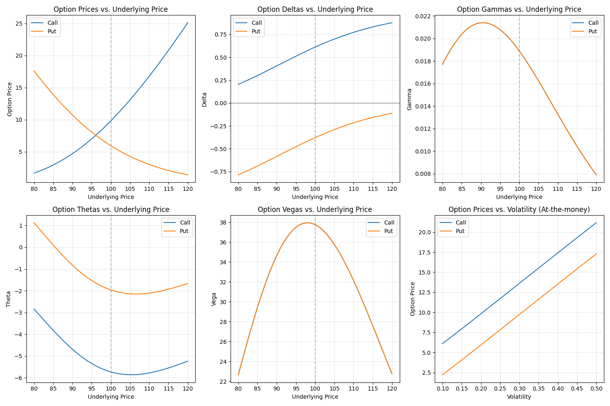

# Black-Scholes Option Pricing Model

The `black_scholes` function implements the classic Black-Scholes-Merton model for pricing European options. This analytical model provides closed-form solutions for option prices and Greeks under specific assumptions about market behavior.

## Usage in Pypulate

```python
from pypulate.asset import black_scholes

# Calculate price for a European call option
result = black_scholes(
    option_type='call',
    underlying_price=100,
    strike_price=100,
    time_to_expiry=1.0,
    risk_free_rate=0.05,
    volatility=0.2,
    dividend_yield=0.01
)

# Access the results
option_price = result["price"]
delta = result["delta"]
gamma = result["gamma"]
theta = result["theta"]
vega = result["vega"]
rho = result["rho"]

print(f"Option Price: ${option_price:.2f}")
print(f"Delta: {delta:.4f}")
print(f"Gamma: {gamma:.6f}")
print(f"Theta: {theta:.6f}")
print(f"Vega: {vega:.6f}")
print(f"Rho: {rho:.6f}")
```

## Parameters

| Parameter | Type | Description | Default |
|-----------|------|-------------|---------|
| `option_type` | str | Type of option ('call' or 'put') | Required |
| `underlying_price` | float | Current price of the underlying asset | Required |
| `strike_price` | float | Strike price of the option | Required |
| `time_to_expiry` | float | Time to expiration in years | Required |
| `risk_free_rate` | float | Risk-free interest rate (annualized) | Required |
| `volatility` | float | Volatility of the underlying asset (annualized) | Required |
| `dividend_yield` | float | Continuous dividend yield | 0.0 |

## Return Value

The function returns a dictionary with the following keys:

| Key | Type | Description |
|-----|------|-------------|
| `price` | float | Calculated option price |
| `delta` | float | First derivative of option price with respect to underlying price |
| `gamma` | float | Second derivative of option price with respect to underlying price |
| `theta` | float | Rate of change of option price with respect to time (time decay) |
| `vega` | float | Sensitivity of option price to volatility |
| `rho` | float | Sensitivity of option price to risk-free interest rate |
| `d1` | float | Intermediate calculation in the Black-Scholes formula |
| `d2` | float | Intermediate calculation in the Black-Scholes formula |
| `underlying_price` | float | Price of the underlying asset used in calculation |
| `strike_price` | float | Strike price used in calculation |
| `time_to_expiry` | float | Time to expiration used in calculation |
| `risk_free_rate` | float | Risk-free rate used in calculation |
| `volatility` | float | Volatility used in calculation |
| `dividend_yield` | float | Dividend yield used in calculation |

## Risk Level Classification

Option pricing models can be classified based on their volatility input:

| Volatility Range | Risk Assessment |
|------------------|-----------------|
| < 0.15 | Low volatility |
| 0.15 - 0.25 | Moderate volatility |
| 0.25 - 0.35 | High volatility |
| > 0.35 | Very high volatility |

## Implied Volatility

Pypulate also provides an `implied_volatility` function to calculate the implied volatility from market prices:

```python
from pypulate.asset import implied_volatility

# Calculate implied volatility from market price
result = implied_volatility(
    option_type='call',
    market_price=10.5,
    underlying_price=100,
    strike_price=100,
    time_to_expiry=1.0,
    risk_free_rate=0.05,
    dividend_yield=0.01
)

# Access the results
implied_vol = result["implied_volatility"]
calculated_price = result["calculated_price"]
price_difference = result["price_difference"]

print(f"Implied Volatility: {implied_vol:.2%}")
print(f"Calculated Price: ${calculated_price:.2f}")
print(f"Price Difference: ${price_difference:.6f}")
```

### Implied Volatility Parameters

| Parameter | Type | Description | Default |
|-----------|------|-------------|---------|
| `option_type` | str | Type of option ('call' or 'put') | Required |
| `market_price` | float | Market price of the option | Required |
| `underlying_price` | float | Current price of the underlying asset | Required |
| `strike_price` | float | Strike price of the option | Required |
| `time_to_expiry` | float | Time to expiration in years | Required |
| `risk_free_rate` | float | Risk-free interest rate (annualized) | Required |
| `dividend_yield` | float | Continuous dividend yield | 0.0 |
| `precision` | float | Desired precision for implied volatility | 0.0001 |
| `max_iterations` | int | Maximum number of iterations | 100 |
| `initial_vol` | float | Initial volatility guess | 0.2 |

### Implied Volatility Return Value

| Key | Type | Description |
|-----|------|-------------|
| `implied_volatility` | float | Calculated implied volatility |
| `market_price` | float | Market price of the option |
| `calculated_price` | float | Option price calculated using the implied volatility |
| `price_difference` | float | Absolute difference between market and calculated prices |
| `delta` | float | Option delta using implied volatility |
| `gamma` | float | Option gamma using implied volatility |
| `theta` | float | Option theta using implied volatility |
| `vega` | float | Option vega using implied volatility |
| `rho` | float | Option rho using implied volatility |

## Comprehensive Example

Here's a complete example demonstrating how to use the Black-Scholes model for option pricing and analysis:

```python
import numpy as np
import matplotlib.pyplot as plt
from pypulate.asset import black_scholes, implied_volatility

# Define option parameters
underlying_prices = np.linspace(80, 120, 41)  # Range of underlying prices
strike_price = 100
time_to_expiry = 1.0
risk_free_rate = 0.05
volatility = 0.2
dividend_yield = 0.01

# Calculate option prices for different option types
option_types = ['call', 'put']
option_prices = {option_type: [] for option_type in option_types}
option_deltas = {option_type: [] for option_type in option_types}
option_gammas = {option_type: [] for option_type in option_types}
option_thetas = {option_type: [] for option_type in option_types}
option_vegas = {option_type: [] for option_type in option_types}

for price in underlying_prices:
    for option_type in option_types:
        result = black_scholes(
            option_type=option_type,
            underlying_price=price,
            strike_price=strike_price,
            time_to_expiry=time_to_expiry,
            risk_free_rate=risk_free_rate,
            volatility=volatility,
            dividend_yield=dividend_yield
        )
        option_prices[option_type].append(result['price'])
        option_deltas[option_type].append(result['delta'])
        option_gammas[option_type].append(result['gamma'])
        option_thetas[option_type].append(result['theta'])
        option_vegas[option_type].append(result['vega'])

# Visualize option prices and Greeks
plt.figure(figsize=(15, 10))

# Plot option prices
plt.subplot(2, 3, 1)
for option_type in option_types:
    plt.plot(underlying_prices, option_prices[option_type], label=option_type.title())
plt.axvline(x=strike_price, color='gray', linestyle='--', alpha=0.5)
plt.grid(True, alpha=0.3)
plt.xlabel('Underlying Price')
plt.ylabel('Option Price')
plt.title('Option Prices vs. Underlying Price')
plt.legend()

# Plot option deltas
plt.subplot(2, 3, 2)
for option_type in option_types:
    plt.plot(underlying_prices, option_deltas[option_type], label=option_type.title())
plt.axvline(x=strike_price, color='gray', linestyle='--', alpha=0.5)
plt.axhline(y=0, color='black', linestyle='-', alpha=0.3)
plt.grid(True, alpha=0.3)
plt.xlabel('Underlying Price')
plt.ylabel('Delta')
plt.title('Option Deltas vs. Underlying Price')
plt.legend()

# Plot option gammas
plt.subplot(2, 3, 3)
for option_type in option_types:
    plt.plot(underlying_prices, option_gammas[option_type], label=option_type.title())
plt.axvline(x=strike_price, color='gray', linestyle='--', alpha=0.5)
plt.grid(True, alpha=0.3)
plt.xlabel('Underlying Price')
plt.ylabel('Gamma')
plt.title('Option Gammas vs. Underlying Price')
plt.legend()

# Plot option thetas
plt.subplot(2, 3, 4)
for option_type in option_types:
    plt.plot(underlying_prices, option_thetas[option_type], label=option_type.title())
plt.axvline(x=strike_price, color='gray', linestyle='--', alpha=0.5)
plt.grid(True, alpha=0.3)
plt.xlabel('Underlying Price')
plt.ylabel('Theta')
plt.title('Option Thetas vs. Underlying Price')
plt.legend()

# Plot option vegas
plt.subplot(2, 3, 5)
for option_type in option_types:
    plt.plot(underlying_prices, option_vegas[option_type], label=option_type.title())
plt.axvline(x=strike_price, color='gray', linestyle='--', alpha=0.5)
plt.grid(True, alpha=0.3)
plt.xlabel('Underlying Price')
plt.ylabel('Vega')
plt.title('Option Vegas vs. Underlying Price')
plt.legend()

# Analyze impact of volatility on option price
volatilities = np.linspace(0.1, 0.5, 9)
vol_prices = {option_type: [] for option_type in option_types}

for vol in volatilities:
    for option_type in option_types:
        result = black_scholes(
            option_type=option_type,
            underlying_price=strike_price,  # At-the-money
            strike_price=strike_price,
            time_to_expiry=time_to_expiry,
            risk_free_rate=risk_free_rate,
            volatility=vol,
            dividend_yield=dividend_yield
        )
        vol_prices[option_type].append(result['price'])

# Plot volatility impact
plt.subplot(2, 3, 6)
for option_type in option_types:
    plt.plot(volatilities, vol_prices[option_type], label=option_type.title())
plt.grid(True, alpha=0.3)
plt.xlabel('Volatility')
plt.ylabel('Option Price')
plt.title('Option Prices vs. Volatility (At-the-money)')
plt.legend()

plt.tight_layout()
plt.show()

# Demonstrate implied volatility calculation
print("\nImplied Volatility Calculation:")
print("-------------------------------")

# Create a synthetic market price with a slightly different volatility
true_volatility = 0.25
market_result = black_scholes(
    option_type='call',
    underlying_price=100,
    strike_price=100,
    time_to_expiry=1.0,
    risk_free_rate=0.05,
    volatility=true_volatility,
    dividend_yield=0.01
)
market_price = market_result['price']

# Calculate implied volatility from the market price
iv_result = implied_volatility(
    option_type='call',
    market_price=market_price,
    underlying_price=100,
    strike_price=100,
    time_to_expiry=1.0,
    risk_free_rate=0.05,
    dividend_yield=0.01
)

print(f"True Volatility: {true_volatility:.2%}")
print(f"Market Price: ${market_price:.2f}")
print(f"Implied Volatility: {iv_result['implied_volatility']:.2%}")
print(f"Calculated Price: ${iv_result['calculated_price']:.2f}")
print(f"Price Difference: ${iv_result['price_difference']:.6f}")

# Analyze volatility smile/skew
print("\nVolatility Smile Analysis:")
print("-------------------------")

# Generate synthetic market prices for different strikes
strikes = np.linspace(80, 120, 9)
market_prices = {}
implied_vols = {}

# Create a volatility skew (higher implied vol for OTM puts, lower for OTM calls)
base_vol = 0.2
skew_factor = 0.002

for option_type in option_types:
    market_prices[option_type] = []
    implied_vols[option_type] = []
    
    for k in strikes:
        # Adjust volatility based on strike (creating a skew)
        if option_type == 'call':
            adjusted_vol = base_vol - skew_factor * (k - strike_price)
        else:
            adjusted_vol = base_vol + skew_factor * (strike_price - k)
        
        # Ensure volatility is positive
        adjusted_vol = max(0.05, adjusted_vol)
        
        # Calculate synthetic market price
        result = black_scholes(
            option_type=option_type,
            underlying_price=100,
            strike_price=k,
            time_to_expiry=1.0,
            risk_free_rate=0.05,
            volatility=adjusted_vol,
            dividend_yield=0.01
        )
        market_price = result['price']
        market_prices[option_type].append(market_price)
        
        # Calculate implied volatility
        iv_result = implied_volatility(
            option_type=option_type,
            market_price=market_price,
            underlying_price=100,
            strike_price=k,
            time_to_expiry=1.0,
            risk_free_rate=0.05,
            dividend_yield=0.01
        )
        implied_vols[option_type].append(iv_result['implied_volatility'])

# Plot volatility smile/skew
plt.figure(figsize=(10, 6))
for option_type in option_types:
    plt.plot(strikes, implied_vols[option_type], 'o-', label=option_type.title())
plt.axvline(x=strike_price, color='gray', linestyle='--', alpha=0.5)
plt.grid(True, alpha=0.3)
plt.xlabel('Strike Price')
plt.ylabel('Implied Volatility')
plt.title('Volatility Smile/Skew')
plt.legend()
plt.show()

# Print some values from the volatility smile
print(f"{'Strike':<10} {'Call IV':<10} {'Put IV':<10}")
print("-" * 30)
for i, k in enumerate(strikes):
    print(f"{k:<10.1f} {implied_vols['call'][i]:<10.2%} {implied_vols['put'][i]:<10.2%}")
```

## Example Output

```
Implied Volatility Calculation:
-------------------------------
True Volatility: 25.00%
Market Price: $11.72
Implied Volatility: 25.00%
Calculated Price: $11.72
Price Difference: $0.000524
Volatility Smile Analysis:
-------------------------
Strike     Call IV    Put IV    
------------------------------
80.0       24.00%     24.00%    
85.0       23.00%     23.00%    
90.0       22.00%     22.00%    
95.0       21.00%     21.00%    
100.0      20.00%     20.00%    
105.0      19.00%     19.00%    
110.0      18.00%     18.00%    
115.0      17.00%     17.00%    
120.0      16.00%     16.00%    
```

## Visualizations

### Option Prices vs. Underlying Price

This chart shows how option prices change with the underlying asset price for different option types. Call options increase in value as the underlying price increases, while put options decrease.



### Option Greeks

The Greeks charts illustrate how these risk measures change with the underlying price:

- **Delta**: Represents the rate of change of the option price with respect to changes in the underlying asset's price
- **Gamma**: Measures the rate of change in Delta with respect to changes in the underlying price
- **Theta**: Represents the rate of change of the option price with respect to the passage of time (time decay)
- **Vega**: Measures the sensitivity of the option price to changes in volatility


### Volatility Impact

This chart demonstrates how increasing volatility affects option prices. Higher volatility increases option prices for both calls and puts.


### Volatility Smile/Skew

The volatility smile/skew chart shows how implied volatility varies across different strike prices, forming a characteristic curve that deviates from the constant volatility assumption of the Black-Scholes model.


## Theoretical Background

The Black-Scholes model is based on the following assumptions:

1. The underlying asset price follows a geometric Brownian motion with constant drift and volatility
2. Markets are frictionless (no transaction costs or taxes)
3. Risk-free borrowing and lending is possible at a constant rate
4. The underlying asset pays a known continuous dividend yield
5. No arbitrage opportunities exist
6. Trading is continuous
7. Options are European (can only be exercised at expiration)

The Black-Scholes formula for a European call option is:

$C = S_0 e^{-q T} N(d_1) - K e^{-r T} N(d_2)$

And for a European put option:

$P = K e^{-r T} N(-d_2) - S_0 e^{-q T} N(-d_1)$

Where:
- $C$ is the call option price
- $P$ is the put option price
- $S_0$ is the current underlying price
- $K$ is the strike price
- $r$ is the risk-free rate
- $q$ is the dividend yield
- $T$ is the time to expiration
- $\sigma$ is the volatility
- $N(x)$ is the cumulative distribution function of the standard normal distribution

And:
- $d_1 = \frac{\ln(S_0/K) + (r - q + \sigma^2/2)T}{\sigma\sqrt{T}}$
- $d_2 = d_1 - \sigma\sqrt{T}$

## Practical Applications

The Black-Scholes model is used for:

1. **Option Pricing**: Calculating fair values for European options
2. **Risk Management**: Computing option Greeks for hedging strategies
3. **Implied Volatility**: Extracting market expectations of future volatility
4. **Volatility Surface**: Analyzing the term structure and skew of implied volatility
5. **Derivatives Valuation**: Serving as a foundation for more complex models

## Limitations

The Black-Scholes model has several limitations:

1. **European Options Only**: Cannot handle early exercise features of American options
2. **Constant Volatility Assumption**: Real markets exhibit volatility smiles and term structures
3. **Log-Normal Distribution**: Actual returns often have fatter tails than the normal distribution
4. **Continuous Trading**: Real markets have discrete trading and jumps
5. **Perfect Liquidity**: Assumes no bid-ask spreads or market impact
6. **Known Constant Parameters**: Interest rates and volatility may change over time

## Extensions

Several extensions to the basic Black-Scholes model address its limitations:

1. **Stochastic Volatility Models**: Incorporate time-varying volatility (e.g., Heston model)
2. **Jump-Diffusion Models**: Account for price jumps in the underlying asset (e.g., Merton model)
3. **Local Volatility Models**: Allow volatility to depend on both time and asset price (e.g., Dupire model)
4. **SABR Model**: Captures both stochastic volatility and correlation between asset price and volatility
5. **Black-Scholes with Dividends**: Adjustments for discrete dividend payments 