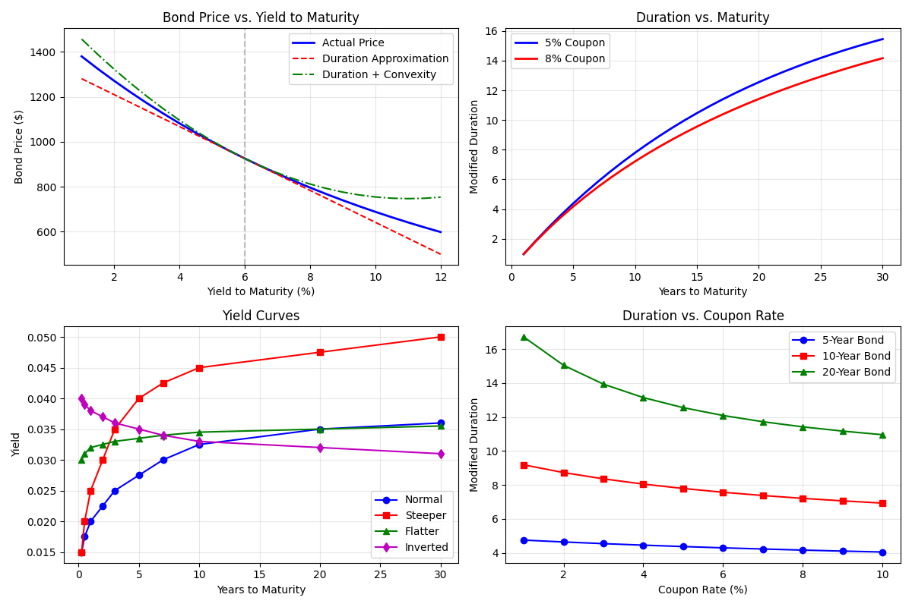

# Bond Pricing and Fixed Income Analysis

The bond pricing module provides functions for analyzing fixed income securities, including price calculation, yield to maturity determination, and duration/convexity analysis. These tools are essential for bond valuation and interest rate risk management.

## Usage in Pypulate

```python
from pypulate.asset import price_bond, yield_to_maturity, duration_convexity

# Calculate the price of a bond
price_result = price_bond(
    face_value=1000,
    coupon_rate=0.05,
    years_to_maturity=10,
    yield_to_maturity=0.06,
    frequency=2
)

# Calculate yield to maturity from a bond price
ytm_result = yield_to_maturity(
    price=950,
    face_value=1000,
    coupon_rate=0.05,
    years_to_maturity=10,
    frequency=2
)

# Calculate duration and convexity measures
risk_result = duration_convexity(
    face_value=1000,
    coupon_rate=0.05,
    years_to_maturity=10,
    yield_to_maturity=0.06,
    frequency=2
)

print(f"Bond Price: ${price_result['price']:.2f}")
print(f"Yield to Maturity: {ytm_result['yield_to_maturity']:.2%}")
print(f"Modified Duration: {risk_result['modified_duration']:.2f}")
print(f"Convexity: {risk_result['convexity']:.2f}")
```

## Bond Pricing Function

### Parameters

| Parameter | Type | Description | Default |
|-----------|------|-------------|---------|
| `face_value` | float | Face value (par value) of the bond | Required |
| `coupon_rate` | float | Annual coupon rate as a decimal (e.g., 0.05 for 5%) | Required |
| `years_to_maturity` | float | Years until the bond matures | Required |
| `yield_to_maturity` | float | Annual yield to maturity as a decimal (e.g., 0.06 for 6%) | Required |
| `frequency` | int | Number of coupon payments per year | 2 (semi-annual) |

### Return Value

The `price_bond` function returns a dictionary with the following keys:

| Key | Type | Description |
|-----|------|-------------|
| `price` | float | Calculated bond price |
| `face_value` | float | Face value of the bond |
| `coupon_rate` | float | Annual coupon rate |
| `years_to_maturity` | float | Years until maturity |
| `yield_to_maturity` | float | Annual yield to maturity |
| `frequency` | int | Number of coupon payments per year |
| `coupon_payment` | float | Amount of each coupon payment |
| `current_yield` | float | Current yield (annual coupon / price) |
| `status` | str | Bond status ("At par", "Trading at premium", or "Trading at discount") |

## Yield to Maturity Function

### Parameters

| Parameter | Type | Description | Default |
|-----------|------|-------------|---------|
| `price` | float | Current market price of the bond | Required |
| `face_value` | float | Face value (par value) of the bond | Required |
| `coupon_rate` | float | Annual coupon rate as a decimal (e.g., 0.05 for 5%) | Required |
| `years_to_maturity` | float | Years until the bond matures | Required |
| `frequency` | int | Number of coupon payments per year | 2 (semi-annual) |
| `initial_guess` | float | Initial guess for YTM calculation | 0.05 (5%) |
| `precision` | float | Desired precision for YTM calculation | 1e-10 |
| `max_iterations` | int | Maximum number of iterations | 100 |

### Return Value

The `yield_to_maturity` function returns a dictionary with the following keys:

| Key | Type | Description |
|-----|------|-------------|
| `yield_to_maturity` | float | Calculated yield to maturity |
| `price` | float | Bond price used in calculation |
| `face_value` | float | Face value of the bond |
| `coupon_rate` | float | Annual coupon rate |
| `years_to_maturity` | float | Years until maturity |
| `frequency` | int | Number of coupon payments per year |
| `coupon_payment` | float | Amount of each coupon payment |
| `current_yield` | float | Current yield (annual coupon / price) |
| `status` | str | Bond status ("At par", "Trading at premium", or "Trading at discount") |

## Duration and Convexity Function

### Parameters

| Parameter | Type | Description | Default |
|-----------|------|-------------|---------|
| `face_value` | float | Face value (par value) of the bond | Required |
| `coupon_rate` | float | Annual coupon rate as a decimal (e.g., 0.05 for 5%) | Required |
| `years_to_maturity` | float | Years until the bond matures | Required |
| `yield_to_maturity` | float | Annual yield to maturity as a decimal (e.g., 0.06 for 6%) | Required |
| `frequency` | int | Number of coupon payments per year | 2 (semi-annual) |

### Return Value

The `duration_convexity` function returns a dictionary with the following keys:

| Key | Type | Description |
|-----|------|-------------|
| `macaulay_duration` | float | Macaulay duration in years |
| `modified_duration` | float | Modified duration (sensitivity to interest rate changes) |
| `convexity` | float | Convexity measure (curvature of price-yield relationship) |
| `price` | float | Calculated bond price |
| `face_value` | float | Face value of the bond |
| `coupon_rate` | float | Annual coupon rate |
| `years_to_maturity` | float | Years until maturity |
| `yield_to_maturity` | float | Annual yield to maturity |
| `frequency` | int | Number of coupon payments per year |
| `price_change_1bp` | float | Estimated price change for a 1 basis point increase in yield |
| `price_change_100bp` | float | Estimated price change for a 100 basis point increase in yield |
| `convexity_adjustment_100bp` | float | Convexity adjustment for a 100 basis point yield change |
| `price_change_100bp_with_convexity` | float | Price change with convexity adjustment |

## Risk Level Classification

Bonds can be classified based on their duration, which measures interest rate risk:

| Modified Duration | Risk Assessment |
|-------------------|-----------------|
| < 3 | Low interest rate risk |
| 3 - 7 | Moderate interest rate risk |
| 7 - 12 | High interest rate risk |
| > 12 | Very high interest rate risk |

## Comprehensive Example

Here's a complete example demonstrating how to use the bond pricing functions for analysis:

```python
import numpy as np
import matplotlib.pyplot as plt
from pypulate.asset import price_bond, yield_to_maturity, duration_convexity

# Define bond parameters
face_value = 1000
coupon_rate = 0.05
years_to_maturity = 10
current_yield = 0.06
frequency = 2

# Calculate bond price
price_result = price_bond(
    face_value=face_value,
    coupon_rate=coupon_rate,
    years_to_maturity=years_to_maturity,
    yield_to_maturity=current_yield,
    frequency=frequency
)

# Calculate duration and convexity
risk_result = duration_convexity(
    face_value=face_value,
    coupon_rate=coupon_rate,
    years_to_maturity=years_to_maturity,
    yield_to_maturity=current_yield,
    frequency=frequency
)

# Print bond details
print("Bond Details:")
print(f"Face Value: ${face_value:.2f}")
print(f"Coupon Rate: {coupon_rate:.2%}")
print(f"Years to Maturity: {years_to_maturity:.1f}")
print(f"Yield to Maturity: {current_yield:.2%}")
print(f"Coupon Payment: ${price_result['coupon_payment']:.2f}")
print(f"Bond Price: ${price_result['price']:.2f}")
print(f"Current Yield: {price_result['current_yield']:.2%}")
print(f"Status: {price_result['status']}")

# Print risk measures
print("\nRisk Measures:")
print(f"Macaulay Duration: {risk_result['macaulay_duration']:.2f} years")
print(f"Modified Duration: {risk_result['modified_duration']:.2f}")
print(f"Convexity: {risk_result['convexity']:.2f}")
print(f"Price Change for 1bp Yield Increase: ${risk_result['price_change_1bp']:.4f}")
print(f"Price Change for 100bp Yield Increase: ${risk_result['price_change_100bp']:.2f}")
print(f"Convexity Adjustment for 100bp: ${risk_result['convexity_adjustment_100bp']:.2f}")
print(f"Price Change with Convexity: ${risk_result['price_change_100bp_with_convexity']:.2f}")

# Analyze price-yield relationship
yields = np.linspace(0.01, 0.12, 23)  # 1% to 12% in 0.5% steps
prices = []
linear_approx = []
quad_approx = []

for ytm in yields:
    # Calculate bond price at this yield
    result = price_bond(
        face_value=face_value,
        coupon_rate=coupon_rate,
        years_to_maturity=years_to_maturity,
        yield_to_maturity=ytm,
        frequency=frequency
    )
    prices.append(result['price'])
    
    # Linear approximation using duration
    delta_y = ytm - current_yield
    linear_price = price_result['price'] - risk_result['modified_duration'] * price_result['price'] * delta_y
    linear_approx.append(linear_price)
    
    # Quadratic approximation using duration and convexity
    quad_price = linear_price + 0.5 * risk_result['convexity'] * price_result['price'] * delta_y**2
    quad_approx.append(quad_price)

# Visualize price-yield relationship
plt.figure(figsize=(12, 8))

# Plot price-yield curve
plt.subplot(2, 2, 1)
plt.plot(yields * 100, prices, 'b-', linewidth=2, label='Actual Price')
plt.plot(yields * 100, linear_approx, 'r--', label='Duration Approximation')
plt.plot(yields * 100, quad_approx, 'g-.', label='Duration + Convexity')
plt.axvline(x=current_yield * 100, color='gray', linestyle='--', alpha=0.5)
plt.grid(True, alpha=0.3)
plt.xlabel('Yield to Maturity (%)')
plt.ylabel('Bond Price ($)')
plt.title('Bond Price vs. Yield to Maturity')
plt.legend()

# Analyze impact of maturity on duration
maturities = np.linspace(1, 30, 30)
durations_5pct = []
durations_8pct = []

for maturity in maturities:
    # Calculate duration for 5% coupon bond
    result_5pct = duration_convexity(
        face_value=face_value,
        coupon_rate=0.05,
        years_to_maturity=maturity,
        yield_to_maturity=0.05,
        frequency=frequency
    )
    durations_5pct.append(result_5pct['modified_duration'])
    
    # Calculate duration for 8% coupon bond
    result_8pct = duration_convexity(
        face_value=face_value,
        coupon_rate=0.08,
        years_to_maturity=maturity,
        yield_to_maturity=0.05,
        frequency=frequency
    )
    durations_8pct.append(result_8pct['modified_duration'])

# Plot maturity vs duration
plt.subplot(2, 2, 2)
plt.plot(maturities, durations_5pct, 'b-', linewidth=2, label='5% Coupon')
plt.plot(maturities, durations_8pct, 'r-', linewidth=2, label='8% Coupon')
plt.grid(True, alpha=0.3)
plt.xlabel('Years to Maturity')
plt.ylabel('Modified Duration')
plt.title('Duration vs. Maturity')
plt.legend()

# Analyze yield curve
years = [0.25, 0.5, 1, 2, 3, 5, 7, 10, 20, 30]
current_yields = [0.0150, 0.0175, 0.0200, 0.0225, 0.0250, 0.0275, 0.0300, 0.0325, 0.0350, 0.0360]
steeper_yields = [0.0150, 0.0200, 0.0250, 0.0300, 0.0350, 0.0400, 0.0425, 0.0450, 0.0475, 0.0500]
flatter_yields = [0.0300, 0.0310, 0.0320, 0.0325, 0.0330, 0.0335, 0.0340, 0.0345, 0.0350, 0.0355]
inverted_yields = [0.0400, 0.0390, 0.0380, 0.0370, 0.0360, 0.0350, 0.0340, 0.0330, 0.0320, 0.0310]

# Plot yield curves
plt.subplot(2, 2, 3)
plt.plot(years, current_yields, 'b-', marker='o', label='Normal')
plt.plot(years, steeper_yields, 'r-', marker='s', label='Steeper')
plt.plot(years, flatter_yields, 'g-', marker='^', label='Flatter')
plt.plot(years, inverted_yields, 'm-', marker='d', label='Inverted')
plt.grid(True, alpha=0.3)
plt.xlabel('Years to Maturity')
plt.ylabel('Yield')
plt.title('Yield Curves')
plt.legend()

# Analyze impact of coupon rate on duration
coupon_rates = np.linspace(0.01, 0.10, 10)
durations_5y = []
durations_10y = []
durations_20y = []

for rate in coupon_rates:
    # 5-year bond
    result_5y = duration_convexity(
        face_value=face_value,
        coupon_rate=rate,
        years_to_maturity=5,
        yield_to_maturity=0.05,
        frequency=frequency
    )
    durations_5y.append(result_5y['modified_duration'])
    
    # 10-year bond
    result_10y = duration_convexity(
        face_value=face_value,
        coupon_rate=rate,
        years_to_maturity=10,
        yield_to_maturity=0.05,
        frequency=frequency
    )
    durations_10y.append(result_10y['modified_duration'])
    
    # 20-year bond
    result_20y = duration_convexity(
        face_value=face_value,
        coupon_rate=rate,
        years_to_maturity=20,
        yield_to_maturity=0.05,
        frequency=frequency
    )
    durations_20y.append(result_20y['modified_duration'])

# Plot coupon rate vs duration
plt.subplot(2, 2, 4)
plt.plot(coupon_rates * 100, durations_5y, 'b-', marker='o', label='5-Year Bond')
plt.plot(coupon_rates * 100, durations_10y, 'r-', marker='s', label='10-Year Bond')
plt.plot(coupon_rates * 100, durations_20y, 'g-', marker='^', label='20-Year Bond')
plt.grid(True, alpha=0.3)
plt.xlabel('Coupon Rate (%)')
plt.ylabel('Modified Duration')
plt.title('Duration vs. Coupon Rate')
plt.legend()

plt.tight_layout()
plt.show()

# Calculate yield to maturity for a given price
ytm_result = yield_to_maturity(
    price=925,
    face_value=face_value,
    coupon_rate=coupon_rate,
    years_to_maturity=years_to_maturity,
    frequency=frequency
)

print("\nYield to Maturity Analysis:")
print(f"Bond Price: ${ytm_result['price']:.2f}")
print(f"Calculated YTM: {ytm_result['yield_to_maturity']:.2%}")
print(f"Current Yield: {ytm_result['current_yield']:.2%}")
print(f"Status: {ytm_result['status']}")
```

## Example Output

```
Bond Details:
Face Value: $1000.00
Coupon Rate: 5.00%
Years to Maturity: 10.0
Yield to Maturity: 6.00%
Coupon Payment: $25.00
Bond Price: $925.61
Current Yield: 5.40%
Status: Trading at discount
Risk Measures:
Macaulay Duration: 7.89 years
Modified Duration: 7.67
Convexity: 152.31
Price Change for 1bp Yield Increase: $-0.7095
Price Change for 100bp Yield Increase: $-70.95
Convexity Adjustment for 100bp: $7.05
Price Change with Convexity: $-63.90
Yield to Maturity Analysis:
Bond Price: $925.00
Calculated YTM: 6.01%
Current Yield: 5.41%
Status: Trading at discount
```

## Visualizations

### Bond Price vs. Yield to Maturity

This chart shows the non-linear relationship between bond price and yield. It also demonstrates how duration and convexity can be used to approximate price changes for different yields.



### Duration vs. Maturity

This chart illustrates how duration increases with maturity, and how higher coupon rates lead to lower duration for bonds with the same maturity.


### Yield Curves

This chart shows different yield curve shapes (normal, steep, flat, and inverted) that can occur in the market, each reflecting different economic expectations.


### Duration vs. Coupon Rate

This chart demonstrates how duration decreases as coupon rate increases, with the effect being more pronounced for longer-term bonds.


## Theoretical Background

### Bond Pricing

The price of a bond is the present value of all future cash flows, discounted at the yield to maturity:

$P = \sum_{t=1}^{n} \frac{C}{(1+y/k)^{t}} + \frac{F}{(1+y/k)^{n}}$

Where:
- $P$ is the bond price
- $C$ is the periodic coupon payment
- $F$ is the face value
- $y$ is the annual yield to maturity
- $k$ is the number of coupon payments per year
- $n$ is the total number of periods ($n = k \times T$, where $T$ is years to maturity)

### Duration

Macaulay duration is the weighted average time to receive the bond's cash flows:

$D_{Mac} = \frac{\sum_{t=1}^{n} \frac{t}{k} \times \frac{CF_t}{(1+y/k)^{t}}}{P}$

Modified duration measures the sensitivity of bond price to yield changes:

$D_{Mod} = \frac{D_{Mac}}{1+y/k}$

For a small change in yield $\Delta y$, the approximate price change is:

$\Delta P \approx -D_{Mod} \times P \times \Delta y$

### Convexity

Convexity measures the curvature of the price-yield relationship:

$C = \frac{1}{P} \sum_{t=1}^{n} \frac{t}{k} \times (\frac{t}{k} + \frac{1}{k}) \times \frac{CF_t}{(1+y/k)^{t}}$

For larger yield changes, convexity improves the price change approximation:

$\Delta P \approx -D_{Mod} \times P \times \Delta y + \frac{1}{2} \times C \times P \times (\Delta y)^2$

## Practical Applications

The bond pricing functions are used for:

1. **Bond Valuation**: Determining the fair value of fixed income securities
2. **Yield Analysis**: Calculating yield to maturity for investment decision-making
3. **Interest Rate Risk Management**: Measuring duration and convexity to assess sensitivity to rate changes
4. **Portfolio Immunization**: Matching asset and liability durations to protect against interest rate movements
5. **Yield Curve Analysis**: Understanding the term structure of interest rates
6. **Bond Trading Strategies**: Identifying relative value opportunities in the fixed income market

## Limitations

The bond pricing model has several limitations:

1. **Constant Yield Assumption**: Assumes the same yield for all future periods
2. **Reinvestment Risk**: Assumes coupon payments can be reinvested at the yield to maturity
3. **Credit Risk**: Does not account for the possibility of default
4. **Liquidity Risk**: Does not consider potential liquidity premiums
5. **Call/Put Features**: Basic model does not handle embedded options
6. **Floating Rate Bonds**: Not designed for bonds with variable coupon rates

## Extensions

Several extensions to the basic bond pricing model address its limitations:

1. **Option-Adjusted Spread (OAS)**: Accounts for embedded options in bonds
2. **Credit Spread Analysis**: Incorporates credit risk into bond valuation
3. **Multi-Factor Term Structure Models**: Models the entire yield curve and its evolution
4. **Key Rate Durations**: Measures sensitivity to changes in specific points on the yield curve
5. **Effective Duration**: Better handles bonds with embedded options or floating rates 