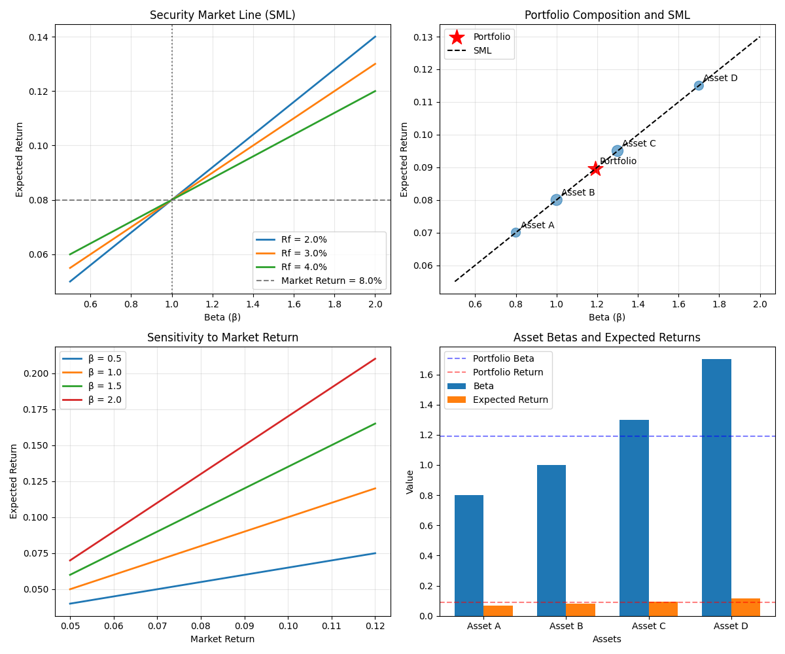

# Capital Asset Pricing Model (CAPM)

The `capm` function implements the Capital Asset Pricing Model, a fundamental model in finance that describes the relationship between systematic risk and expected return for assets, particularly stocks. CAPM is widely used for pricing risky securities and generating expected returns for assets given their risk and the market conditions.

## Usage in Pypulate

```python
from pypulate.asset import capm

# Calculate expected return using CAPM
result = capm(
    risk_free_rate=0.03,    # 3% risk-free rate
    beta=1.2,               # Beta coefficient (systematic risk)
    market_return=0.08      # 8% expected market return
)

# Access the results
expected_return = result["expected_return"]
market_risk_premium = result["market_risk_premium"]
risk_assessment = result["risk_assessment"]

print(f"Expected Return: {expected_return:.2%}")
print(f"Market Risk Premium: {market_risk_premium:.2%}")
print(f"Risk Assessment: {risk_assessment}")
```

## Parameters

| Parameter | Type | Description | Default |
|-----------|------|-------------|---------|
| `risk_free_rate` | float | Risk-free rate of return (e.g., 0.03 for 3%) | Required |
| `beta` | float | Beta of the asset (measure of systematic risk) | Required |
| `market_return` | float | Expected market return (e.g., 0.08 for 8%) | Required |

## Return Value

The function returns a dictionary with the following keys:

| Key | Type | Description |
|-----|------|-------------|
| `expected_return` | float | Expected return calculated using CAPM |
| `risk_free_rate` | float | Risk-free rate used in the calculation |
| `beta` | float | Beta coefficient used in the calculation |
| `market_return` | float | Market return used in the calculation |
| `market_risk_premium` | float | Market risk premium (market return - risk-free rate) |
| `risk_assessment` | str | Qualitative assessment of risk based on beta |

## Risk Level Classification

The beta coefficient is categorized into risk levels:

| Beta Range | Risk Assessment |
|------------|-----------------|
| < 0.8 | Low risk |
| 0.8 - 0.99 | Below-market risk |
| 1.0 - 1.19 | Market-level risk |
| 1.2 - 1.49 | Above-market risk |
| ≥ 1.5 | High risk |

## Comprehensive Example

Here's a complete example demonstrating how to use the CAPM model for asset pricing and portfolio analysis:

```python
import numpy as np
import matplotlib.pyplot as plt
from pypulate.asset import capm

# Define parameters for analysis
risk_free_rates = [0.02, 0.03, 0.04]  # 2%, 3%, 4%
betas = np.linspace(0.5, 2.0, 16)     # Range of beta values
market_return = 0.08                  # 8% market return

# Calculate expected returns for different betas and risk-free rates
expected_returns = {}
for rf in risk_free_rates:
    expected_returns[rf] = []
    for beta in betas:
        result = capm(
            risk_free_rate=rf,
            beta=beta,
            market_return=market_return
        )
        expected_returns[rf].append(result['expected_return'])

# Visualize CAPM results
plt.figure(figsize=(12, 10))

# Plot Security Market Line (SML) for different risk-free rates
plt.subplot(2, 2, 1)
for rf in risk_free_rates:
    plt.plot(betas, expected_returns[rf], 
             label=f'Rf = {rf:.1%}', linewidth=2)
plt.axhline(y=market_return, color='gray', linestyle='--', 
            label=f'Market Return = {market_return:.1%}')
plt.axvline(x=1.0, color='black', linestyle=':', alpha=0.5)
plt.grid(True, alpha=0.3)
plt.xlabel('Beta (β)')
plt.ylabel('Expected Return')
plt.title('Security Market Line (SML)')
plt.legend()

# Analyze a portfolio of assets
assets = {
    'Asset A': {'beta': 0.8, 'weight': 0.2},
    'Asset B': {'beta': 1.0, 'weight': 0.3},
    'Asset C': {'beta': 1.3, 'weight': 0.3},
    'Asset D': {'beta': 1.7, 'weight': 0.2}
}

# Calculate expected returns for each asset
risk_free_rate = 0.03  # Use 3% risk-free rate
for asset_name, asset_data in assets.items():
    result = capm(
        risk_free_rate=risk_free_rate,
        beta=asset_data['beta'],
        market_return=market_return
    )
    asset_data['expected_return'] = result['expected_return']
    asset_data['risk_assessment'] = result['risk_assessment']

# Calculate portfolio beta and expected return
portfolio_beta = sum(asset['beta'] * asset['weight'] for asset in assets.values())
portfolio_return = sum(asset['expected_return'] * asset['weight'] for asset in assets.values())

# Plot portfolio composition
plt.subplot(2, 2, 2)
asset_names = list(assets.keys())
asset_weights = [asset['weight'] for asset in assets.values()]
asset_betas = [asset['beta'] for asset in assets.values()]
asset_returns = [asset['expected_return'] for asset in assets.values()]

# Create bubble chart
bubble_sizes = [weight * 500 for weight in asset_weights]
plt.scatter(asset_betas, asset_returns, s=bubble_sizes, alpha=0.6)

# Add labels to bubbles
for i, name in enumerate(asset_names):
    plt.annotate(name, (asset_betas[i], asset_returns[i]),
                 xytext=(5, 5), textcoords='offset points')

# Add portfolio point
plt.scatter([portfolio_beta], [portfolio_return], s=300, 
            color='red', marker='*', label='Portfolio')
plt.annotate('Portfolio', (portfolio_beta, portfolio_return),
             xytext=(5, 5), textcoords='offset points')

# Add SML line
beta_range = np.array([0.5, 2.0])
sml_returns = risk_free_rate + beta_range * (market_return - risk_free_rate)
plt.plot(beta_range, sml_returns, 'k--', label='SML')

plt.grid(True, alpha=0.3)
plt.xlabel('Beta (β)')
plt.ylabel('Expected Return')
plt.title('Portfolio Composition and SML')
plt.legend()

# Analyze sensitivity to market risk premium
market_returns = np.linspace(0.05, 0.12, 8)  # 5% to 12%
sensitivities = {}

for beta in [0.5, 1.0, 1.5, 2.0]:
    sensitivities[beta] = []
    for mr in market_returns:
        result = capm(
            risk_free_rate=risk_free_rate,
            beta=beta,
            market_return=mr
        )
        sensitivities[beta].append(result['expected_return'])

# Plot sensitivity analysis
plt.subplot(2, 2, 3)
for beta, returns in sensitivities.items():
    plt.plot(market_returns, returns, 
             label=f'β = {beta}', linewidth=2)
plt.grid(True, alpha=0.3)
plt.xlabel('Market Return')
plt.ylabel('Expected Return')
plt.title('Sensitivity to Market Return')
plt.legend()

# Create a bar chart comparing assets
plt.subplot(2, 2, 4)
x = np.arange(len(asset_names))
width = 0.35

plt.bar(x - width/2, asset_betas, width, label='Beta')
plt.bar(x + width/2, asset_returns, width, label='Expected Return')

plt.axhline(y=portfolio_beta, color='blue', linestyle='--', 
            alpha=0.5, label='Portfolio Beta')
plt.axhline(y=portfolio_return, color='red', linestyle='--', 
            alpha=0.5, label='Portfolio Return')

plt.xlabel('Assets')
plt.ylabel('Value')
plt.title('Asset Betas and Expected Returns')
plt.xticks(x, asset_names)
plt.legend()

plt.tight_layout()
plt.show()

# Print detailed results
print("Asset Analysis:")
print(f"{'Asset':<10} {'Beta':<8} {'Expected Return':<18} {'Risk Assessment':<20} {'Weight':<10}")
print("-" * 70)
for asset_name, asset_data in assets.items():
    print(f"{asset_name:<10} {asset_data['beta']:<8.2f} {asset_data['expected_return']:<18.2%} "
          f"{asset_data['risk_assessment']:<20} {asset_data['weight']:<10.1%}")

print("\nPortfolio Analysis:")
print(f"Portfolio Beta: {portfolio_beta:.2f}")
print(f"Portfolio Expected Return: {portfolio_return:.2%}")

# Calculate risk-adjusted return (Sharpe Ratio)
portfolio_sharpe = (portfolio_return - risk_free_rate) / portfolio_beta
print(f"Portfolio Sharpe Ratio: {portfolio_sharpe:.4f}")

# Analyze undervalued/overvalued assets
print("\nValuation Analysis:")
for asset_name, asset_data in assets.items():
    # Calculate the expected return according to CAPM
    capm_return = risk_free_rate + asset_data['beta'] * (market_return - risk_free_rate)
    
    # Assume we have observed returns that might differ from CAPM predictions
    # For demonstration, we'll create hypothetical observed returns
    observed_return = capm_return * (1 + np.random.uniform(-0.2, 0.2))
    
    # Determine if asset is undervalued or overvalued
    if observed_return > capm_return:
        valuation = "Undervalued"
    elif observed_return < capm_return:
        valuation = "Overvalued"
    else:
        valuation = "Fairly valued"
    
    print(f"{asset_name:<10} CAPM Return: {capm_return:.2%}, Observed Return: {observed_return:.2%}, {valuation}")
```

## Example Output

```
Asset Analysis:
Asset      Beta     Expected Return    Risk Assessment     Weight    
----------------------------------------------------------------------
Asset A    0.80     7.00%              Below-market risk   20.0%     
Asset B    1.00     8.00%              Market-level risk   30.0%     
Asset C    1.30     9.50%              Above-market risk   30.0%     
Asset D    1.70     11.50%             High risk           20.0%     

Portfolio Analysis:
Portfolio Beta: 1.19
Portfolio Expected Return: 8.95%
Portfolio Sharpe Ratio: 0.5000

Valuation Analysis:
Asset A    CAPM Return: 7.00%, Observed Return: 7.84%, Undervalued
Asset B    CAPM Return: 8.00%, Observed Return: 6.72%, Overvalued
Asset C    CAPM Return: 9.50%, Observed Return: 10.26%, Undervalued
Asset D    CAPM Return: 11.50%, Observed Return: 9.89%, Overvalued
```

## Visualizations

### Security Market Line (SML)

This chart shows the linear relationship between systematic risk (beta) and expected return according to CAPM. The slope of the line represents the market risk premium.

### Portfolio Composition

This bubble chart illustrates the beta and expected return of individual assets in a portfolio, with bubble size representing the weight of each asset. The portfolio's overall position is also shown relative to the Security Market Line.

### Sensitivity to Market Return

This chart demonstrates how expected returns for assets with different betas change as the market return varies. Assets with higher betas show greater sensitivity to changes in market return.

### Asset Comparison

This bar chart compares the beta coefficients and expected returns of different assets in the portfolio, along with the portfolio's overall beta and expected return.



## Theoretical Background

The Capital Asset Pricing Model (CAPM) was developed by William Sharpe, John Lintner, and Jan Mossin in the 1960s, building on Harry Markowitz's Modern Portfolio Theory.

The model is based on several assumptions:
1. Investors are rational and risk-averse
2. Markets are efficient and frictionless
3. Investors have homogeneous expectations
4. All investors can borrow and lend at the risk-free rate
5. All assets are perfectly divisible and liquid

## Practical Applications

The CAPM model is used for:

1. **Asset Pricing**: Determining the required rate of return for risky assets
2. **Portfolio Management**: Constructing portfolios with desired risk-return characteristics
3. **Capital Budgeting**: Evaluating investment projects by calculating the cost of equity
4. **Performance Evaluation**: Assessing investment performance relative to systematic risk
5. **Valuation**: Identifying undervalued or overvalued securities by comparing expected returns
6. **Risk Management**: Understanding and managing systematic risk exposure

## Limitations

The CAPM model has several limitations:

1. **Single-Factor Model**: Only considers systematic risk (beta) and ignores other factors
2. **Simplified Assumptions**: Real markets violate many of the model's assumptions
3. **Beta Instability**: Beta coefficients may not be stable over time
4. **Market Proxy Issues**: Defining and measuring the "market portfolio" is challenging
5. **Empirical Challenges**: Historical tests have shown mixed support for the model
6. **Time Horizon**: Does not account for different investment horizons

## Extensions

Several extensions to the basic CAPM model address its limitations:

1. **Multi-Factor Models**: Incorporate additional risk factors (e.g., Fama-French Three-Factor Model)
2. **Conditional CAPM**: Allow for time-varying betas and risk premiums
3. **International CAPM**: Account for international investments and currency risk
4. **Consumption CAPM**: Link asset returns to consumption growth
5. **Downside CAPM**: Focus on downside risk rather than total volatility 