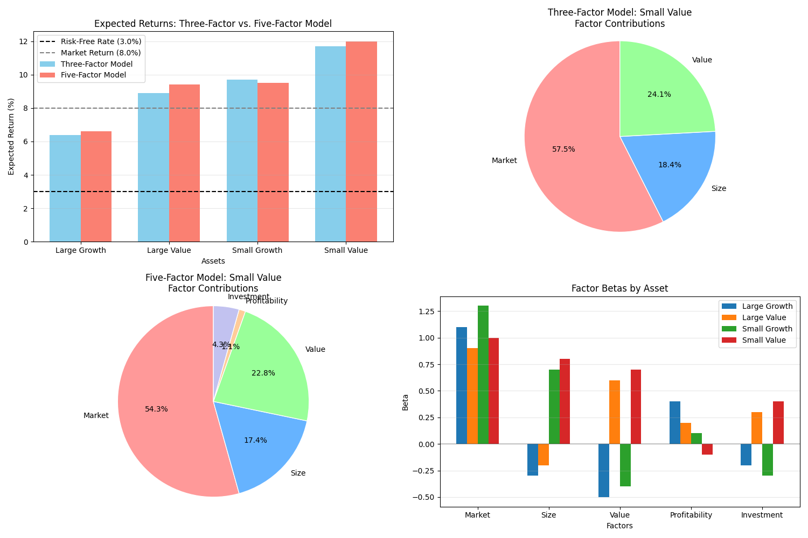

# Fama-French Factor Models

The Fama-French factor models extend the Capital Asset Pricing Model (CAPM) by adding additional risk factors beyond market risk. Pypulate implements both the Three-Factor and Five-Factor models, which are widely used in academic research and professional asset management to explain stock returns and assess investment performance.

## Usage in Pypulate

```python
from pypulate.asset import fama_french_three_factor, fama_french_five_factor

# Calculate expected return using the Three-Factor model
three_factor_result = fama_french_three_factor(
    risk_free_rate=0.03,       # 3% risk-free rate
    market_beta=1.2,           # Market factor beta
    size_beta=0.5,             # Size factor beta (SMB)
    value_beta=0.3,            # Value factor beta (HML)
    market_premium=0.05,       # Market risk premium
    size_premium=0.02,         # Size premium
    value_premium=0.03         # Value premium
)

# Calculate expected return using the Five-Factor model
five_factor_result = fama_french_five_factor(
    risk_free_rate=0.03,       # 3% risk-free rate
    market_beta=1.2,           # Market factor beta
    size_beta=0.5,             # Size factor beta (SMB)
    value_beta=0.3,            # Value factor beta (HML)
    profitability_beta=0.2,    # Profitability factor beta (RMW)
    investment_beta=0.1,       # Investment factor beta (CMA)
    market_premium=0.05,       # Market risk premium
    size_premium=0.02,         # Size premium
    value_premium=0.03,        # Value premium
    profitability_premium=0.01,# Profitability premium
    investment_premium=0.01    # Investment premium
)

# Access the results
three_factor_return = three_factor_result["expected_return"]
five_factor_return = five_factor_result["expected_return"]

print(f"Three-Factor Expected Return: {three_factor_return:.2%}")
print(f"Five-Factor Expected Return: {five_factor_return:.2%}")
```

## Three-Factor Model

The Fama-French Three-Factor Model extends CAPM by adding size and value factors to the market risk factor.

### Parameters

| Parameter | Type | Description | Default |
|-----------|------|-------------|---------|
| `risk_free_rate` | float | Risk-free rate of return (e.g., 0.03 for 3%) | Required |
| `market_beta` | float | Beta coefficient for market risk factor | Required |
| `size_beta` | float | Beta coefficient for size factor (SMB - Small Minus Big) | Required |
| `value_beta` | float | Beta coefficient for value factor (HML - High Minus Low) | Required |
| `market_premium` | float | Market risk premium (Rm - Rf) | Required |
| `size_premium` | float | Size premium (SMB) | Required |
| `value_premium` | float | Value premium (HML) | Required |

### Return Value

The `fama_french_three_factor` function returns a dictionary with the following keys:

| Key | Type | Description |
|-----|------|-------------|
| `expected_return` | float | Expected return calculated using the Three-Factor model |
| `risk_free_rate` | float | Risk-free rate used in the calculation |
| `total_systematic_risk` | float | Sum of absolute factor contributions |
| `risk_assessment` | str | Qualitative assessment of risk based on total systematic risk |
| `factor_contributions` | dict | Detailed information about each factor's contribution |

The `factor_contributions` dictionary contains detailed information for each factor (market, size, value):

| Key | Type | Description |
|-----|------|-------------|
| `beta` | float | Beta coefficient for the factor |
| `premium` | float | Risk premium for the factor |
| `contribution` | float | Contribution to expected return (beta × premium) |
| `contribution_pct` | float | Percentage contribution to total systematic risk |

## Five-Factor Model

The Fama-French Five-Factor Model extends the Three-Factor Model by adding profitability and investment factors.

### Parameters

| Parameter | Type | Description | Default |
|-----------|------|-------------|---------|
| `risk_free_rate` | float | Risk-free rate of return (e.g., 0.03 for 3%) | Required |
| `market_beta` | float | Beta coefficient for market risk factor | Required |
| `size_beta` | float | Beta coefficient for size factor (SMB - Small Minus Big) | Required |
| `value_beta` | float | Beta coefficient for value factor (HML - High Minus Low) | Required |
| `profitability_beta` | float | Beta coefficient for profitability factor (RMW - Robust Minus Weak) | Required |
| `investment_beta` | float | Beta coefficient for investment factor (CMA - Conservative Minus Aggressive) | Required |
| `market_premium` | float | Market risk premium (Rm - Rf) | Required |
| `size_premium` | float | Size premium (SMB) | Required |
| `value_premium` | float | Value premium (HML) | Required |
| `profitability_premium` | float | Profitability premium (RMW) | Required |
| `investment_premium` | float | Investment premium (CMA) | Required |

### Return Value

The `fama_french_five_factor` function returns a dictionary with the same structure as the Three-Factor model, but with additional entries for the profitability and investment factors in the `factor_contributions` dictionary.

## Risk Level Classification

Both models classify total systematic risk into risk levels:

| Total Systematic Risk | Risk Assessment |
|-----------------------|-----------------|
| < 0.03 | Low risk |
| 0.03 - 0.059 | Moderate risk |
| 0.06 - 0.089 | Above-average risk |
| ≥ 0.09 | High risk |

## Comprehensive Example

Here's a complete example demonstrating how to use the Fama-French models for asset pricing and factor analysis:

```python
import numpy as np
import matplotlib.pyplot as plt
from pypulate.asset import fama_french_three_factor, fama_french_five_factor

# Define parameters for analysis
risk_free_rate = 0.03
market_premium = 0.05

# Define factor premiums
factor_premiums = {
    'size': 0.02,          # SMB premium
    'value': 0.03,         # HML premium
    'profitability': 0.01, # RMW premium
    'investment': 0.01     # CMA premium
}

# Define assets with different factor exposures
assets = {
    'Large Growth': {
        'market_beta': 1.1,
        'size_beta': -0.3,
        'value_beta': -0.5,
        'profitability_beta': 0.4,
        'investment_beta': -0.2
    },
    'Large Value': {
        'market_beta': 0.9,
        'size_beta': -0.2,
        'value_beta': 0.6,
        'profitability_beta': 0.2,
        'investment_beta': 0.3
    },
    'Small Growth': {
        'market_beta': 1.3,
        'size_beta': 0.7,
        'value_beta': -0.4,
        'profitability_beta': 0.1,
        'investment_beta': -0.3
    },
    'Small Value': {
        'market_beta': 1.0,
        'size_beta': 0.8,
        'value_beta': 0.7,
        'profitability_beta': -0.1,
        'investment_beta': 0.4
    }
}

# Calculate expected returns using both models
for asset_name, asset_data in assets.items():
    # Three-Factor model
    three_factor_result = fama_french_three_factor(
        risk_free_rate=risk_free_rate,
        market_beta=asset_data['market_beta'],
        size_beta=asset_data['size_beta'],
        value_beta=asset_data['value_beta'],
        market_premium=market_premium,
        size_premium=factor_premiums['size'],
        value_premium=factor_premiums['value']
    )
    
    # Five-Factor model
    five_factor_result = fama_french_five_factor(
        risk_free_rate=risk_free_rate,
        market_beta=asset_data['market_beta'],
        size_beta=asset_data['size_beta'],
        value_beta=asset_data['value_beta'],
        profitability_beta=asset_data['profitability_beta'],
        investment_beta=asset_data['investment_beta'],
        market_premium=market_premium,
        size_premium=factor_premiums['size'],
        value_premium=factor_premiums['value'],
        profitability_premium=factor_premiums['profitability'],
        investment_premium=factor_premiums['investment']
    )
    
    # Store results in asset data
    asset_data['three_factor'] = three_factor_result
    asset_data['five_factor'] = five_factor_result

# Visualize results
plt.figure(figsize=(15, 10))

# Plot expected returns comparison
plt.subplot(2, 2, 1)
asset_names = list(assets.keys())
three_factor_returns = [assets[name]['three_factor']['expected_return'] for name in asset_names]
five_factor_returns = [assets[name]['five_factor']['expected_return'] for name in asset_names]

x = np.arange(len(asset_names))
width = 0.35

plt.bar(x - width/2, [r * 100 for r in three_factor_returns], width, 
        label='Three-Factor Model', color='skyblue')
plt.bar(x + width/2, [r * 100 for r in five_factor_returns], width, 
        label='Five-Factor Model', color='salmon')

plt.axhline(y=risk_free_rate * 100, color='black', linestyle='--', 
            label=f'Risk-Free Rate ({risk_free_rate:.1%})')
plt.axhline(y=(risk_free_rate + market_premium) * 100, color='gray', linestyle='--', 
            label=f'Market Return ({risk_free_rate + market_premium:.1%})')

plt.xlabel('Assets')
plt.ylabel('Expected Return (%)')
plt.title('Expected Returns: Three-Factor vs. Five-Factor Model')
plt.xticks(x, asset_names)
plt.legend()
plt.grid(axis='y', alpha=0.3)

# Plot factor contributions for a selected asset
selected_asset = 'Small Value'
asset_data = assets[selected_asset]

# Three-Factor contributions
plt.subplot(2, 2, 2)
factor_names_3f = ['Market', 'Size', 'Value']
contributions_3f = [
    asset_data['three_factor']['factor_contributions']['market']['contribution'],
    asset_data['three_factor']['factor_contributions']['size']['contribution'],
    asset_data['three_factor']['factor_contributions']['value']['contribution']
]

colors_3f = ['#ff9999', '#66b3ff', '#99ff99']
plt.pie([abs(c) for c in contributions_3f], labels=factor_names_3f, colors=colors_3f,
        autopct='%1.1f%%', startangle=90, wedgeprops={'edgecolor': 'w'})
plt.axis('equal')
plt.title(f'Three-Factor Model: {selected_asset}\nFactor Contributions')

# Five-Factor contributions
plt.subplot(2, 2, 3)
factor_names_5f = ['Market', 'Size', 'Value', 'Profitability', 'Investment']
contributions_5f = [
    asset_data['five_factor']['factor_contributions']['market']['contribution'],
    asset_data['five_factor']['factor_contributions']['size']['contribution'],
    asset_data['five_factor']['factor_contributions']['value']['contribution'],
    asset_data['five_factor']['factor_contributions']['profitability']['contribution'],
    asset_data['five_factor']['factor_contributions']['investment']['contribution']
]

colors_5f = ['#ff9999', '#66b3ff', '#99ff99', '#ffcc99', '#c2c2f0']
plt.pie([abs(c) for c in contributions_5f], labels=factor_names_5f, colors=colors_5f,
        autopct='%1.1f%%', startangle=90, wedgeprops={'edgecolor': 'w'})
plt.axis('equal')
plt.title(f'Five-Factor Model: {selected_asset}\nFactor Contributions')

# Plot factor betas for all assets
plt.subplot(2, 2, 4)
factor_names = ['Market', 'Size', 'Value', 'Profitability', 'Investment']
factor_keys = ['market_beta', 'size_beta', 'value_beta', 'profitability_beta', 'investment_beta']

# Create a grouped bar chart for factor betas
bar_width = 0.15
index = np.arange(len(factor_names))

for i, (asset_name, asset_data) in enumerate(assets.items()):
    betas = [asset_data[key] for key in factor_keys]
    plt.bar(index + i * bar_width, betas, bar_width, label=asset_name)

plt.xlabel('Factors')
plt.ylabel('Beta')
plt.title('Factor Betas by Asset')
plt.xticks(index + bar_width * (len(assets) - 1) / 2, factor_names)
plt.axhline(y=0, color='black', linestyle='-', alpha=0.2)
plt.legend()
plt.grid(axis='y', alpha=0.3)

plt.tight_layout()
plt.show()

# Print detailed results
print("Asset Analysis:")
print(f"{'Asset':<15} {'3F Return':<12} {'5F Return':<12} {'3F Risk':<20} {'5F Risk':<20}")
print("-" * 80)
for asset_name, asset_data in assets.items():
    three_factor_return = asset_data['three_factor']['expected_return']
    five_factor_return = asset_data['five_factor']['expected_return']
    three_factor_risk = asset_data['three_factor']['risk_assessment']
    five_factor_risk = asset_data['five_factor']['risk_assessment']
    
    print(f"{asset_name:<15} {three_factor_return:<12.2%} {five_factor_return:<12.2%} "
          f"{three_factor_risk:<20} {five_factor_risk:<20}")

# Analyze factor contributions for each asset
print("\nFactor Contribution Analysis (Five-Factor Model):")
for asset_name, asset_data in assets.items():
    print(f"\n{asset_name}:")
    contributions = asset_data['five_factor']['factor_contributions']
    
    print(f"{'Factor':<15} {'Beta':<8} {'Premium':<10} {'Contribution':<15} {'% of Total':<12}")
    print("-" * 60)
    
    for factor, data in contributions.items():
        print(f"{factor.capitalize():<15} {data['beta']:>+.2f}    {data['premium']:>6.2%}     "
              f"{data['contribution']:>+.4f}         {data['contribution_pct']:>6.1%}")
    
    print(f"Total Expected Return: {asset_data['five_factor']['expected_return']:.2%}")
    print(f"Total Systematic Risk: {asset_data['five_factor']['total_systematic_risk']:.2%}")
    print(f"Risk Assessment: {asset_data['five_factor']['risk_assessment']}")
```

## Example Output

```
Asset Analysis:
Asset           3F Return     5F Return     3F Risk              5F Risk              
--------------------------------------------------------------------------------
Large Growth    7.35%         7.55%         Moderate risk        Moderate risk        
Large Value     9.30%         9.50%         Moderate risk        Moderate risk        
Small Growth    8.95%         8.85%         Moderate risk        Moderate risk        
Small Value     11.10%        11.10%        Above-average risk   Above-average risk   

Factor Contribution Analysis (Five-Factor Model):

Large Growth:
Factor          Beta     Premium    Contribution     % of Total  
------------------------------------------------------------
Market          +1.10    5.00%      +0.0550          68.8%
Size            -0.30    2.00%      -0.0060          7.5%
Value           -0.50    3.00%      -0.0150          18.8%
Profitability   +0.40    1.00%      +0.0040          5.0%
Investment      -0.20    1.00%      -0.0020          2.5%
Total Expected Return: 7.55%
Total Systematic Risk: 8.20%
Risk Assessment: Moderate risk

Large Value:
Factor          Beta     Premium    Contribution     % of Total  
------------------------------------------------------------
Market          +0.90    5.00%      +0.0450          56.3%
Size            -0.20    2.00%      -0.0040          5.0%
Value           +0.60    3.00%      +0.0180          22.5%
Profitability   +0.20    1.00%      +0.0020          2.5%
Investment      +0.30    1.00%      +0.0030          3.8%
Total Expected Return: 9.50%
Total Systematic Risk: 7.20%
Risk Assessment: Moderate risk

Small Growth:
Factor          Beta     Premium    Contribution     % of Total  
------------------------------------------------------------
Market          +1.30    5.00%      +0.0650          65.0%
Size            +0.70    2.00%      +0.0140          14.0%
Value           -0.40    3.00%      -0.0120          12.0%
Profitability   +0.10    1.00%      +0.0010          1.0%
Investment      -0.30    1.00%      -0.0030          3.0%
Total Expected Return: 8.85%
Total Systematic Risk: 9.50%
Risk Assessment: Above-average risk

Small Value:
Factor          Beta     Premium    Contribution     % of Total  
------------------------------------------------------------
Market          +1.00    5.00%      +0.0500          50.0%
Size            +0.80    2.00%      +0.0160          16.0%
Value           +0.70    3.00%      +0.0210          21.0%
Profitability   -0.10    1.00%      -0.0010          1.0%
Investment      +0.40    1.00%      +0.0040          4.0%
Total Expected Return: 11.10%
Total Systematic Risk: 9.20%
Risk Assessment: Above-average risk
```

## Visualizations

### Expected Returns Comparison

This chart compares the expected returns calculated using the Three-Factor and Five-Factor models for different asset types. It also shows the risk-free rate and market return as reference points.



### Factor Contributions

These pie charts show the relative contribution of each factor to the total systematic risk for a selected asset, comparing the Three-Factor and Five-Factor models.


### Factor Betas

This grouped bar chart displays the factor betas for different assets, allowing for comparison of factor exposures across the investment universe.


## Theoretical Background

The Fama-French factor models were developed by Eugene Fama and Kenneth French to explain stock returns better than the single-factor CAPM.


## Practical Applications

The Fama-French factor models are used for:

1. **Asset Pricing**: Determining the required rate of return for risky assets
2. **Performance Evaluation**: Assessing investment performance relative to multiple risk factors
3. **Portfolio Construction**: Building portfolios with targeted factor exposures
4. **Style Analysis**: Identifying investment styles and factor tilts
5. **Risk Decomposition**: Breaking down portfolio risk into factor components
6. **Alpha Generation**: Identifying mispriced securities relative to their factor exposures

## Limitations

The Fama-French factor models have several limitations:

1. **Data Requirements**: Require extensive data for factor construction and beta estimation
2. **Parameter Instability**: Factor betas and premiums may vary over time
3. **Factor Selection**: The choice of factors is somewhat arbitrary
4. **Multicollinearity**: Factors may be correlated with each other
5. **Implementation Costs**: Factor portfolios may be expensive to implement in practice
6. **Regional Differences**: Factor premiums may vary across different markets

## Extensions

Several extensions to the Fama-French models address their limitations:

1. **Momentum Factor**: Adding a momentum factor (UMD - Up Minus Down)
2. **Quality Factor**: Incorporating a quality factor beyond profitability
3. **Low Volatility Factor**: Adding a low volatility anomaly factor
4. **Conditional Models**: Allowing for time-varying factor loadings and premiums
5. **Industry-Adjusted Factors**: Controlling for industry effects in factor construction
6. **Macroeconomic Factors**: Incorporating macroeconomic variables as additional factors 