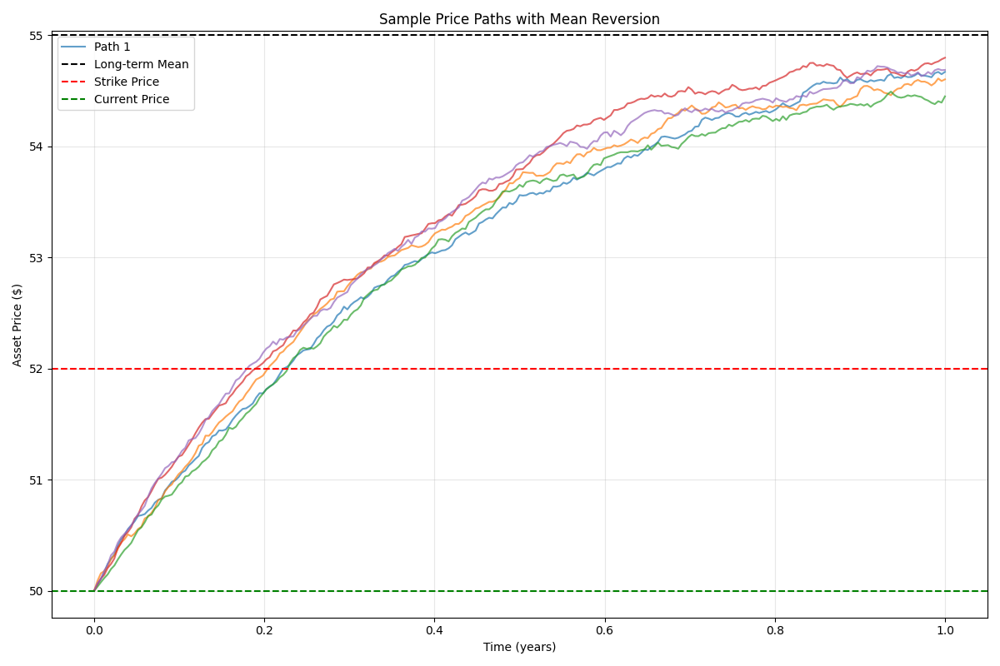
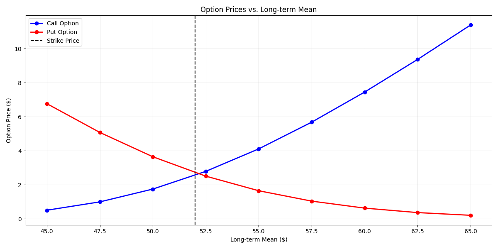

# Mean Inversion Pricing

The mean inversion pricing module provides functions for pricing options on mean-reverting assets using the Ornstein-Uhlenbeck process. This model is particularly useful for commodities, interest rates, volatility indices, and other assets that tend to revert to a long-term mean level over time.

## Usage in Pypulate

```python
from pypulate.asset import mean_inversion_pricing, analytical_mean_inversion_option

# Price a call option on a mean-reverting asset using Monte Carlo simulation
mc_result = mean_inversion_pricing(
    current_price=50,
    long_term_mean=55,
    mean_reversion_rate=2.5,
    volatility=0.3,
    time_to_expiry=1.0,
    risk_free_rate=0.05,
    strike_price=52,
    option_type='call',
    simulations=10000,
    seed=42
)

# Price the same option using the analytical approximation
analytical_result = analytical_mean_inversion_option(
    current_price=50,
    long_term_mean=55,
    mean_reversion_rate=2.5,
    volatility=0.3,
    time_to_expiry=1.0,
    risk_free_rate=0.05,
    strike_price=52,
    option_type='call'
)

# Compare the results
print(f"Monte Carlo Price: ${mc_result['price']:.2f}")
print(f"Analytical Price: ${analytical_result['price']:.2f}")
print(f"Difference: ${abs(mc_result['price'] - analytical_result['price']):.2f}")

# Access additional information
print(f"Expected price at expiry: ${mc_result['expected_price_at_expiry']:.2f}")
print(f"Half-life of mean reversion: {mc_result['half_life']:.2f} years")
```

## Functions

### mean_inversion_pricing

This function implements the Ornstein-Uhlenbeck process to model mean-reverting assets and prices options using Monte Carlo simulation.

#### Parameters

| Parameter | Type | Description | Default |
|-----------|------|-------------|---------|
| `current_price` | float | Current price of the underlying asset | Required |
| `long_term_mean` | float | Long-term mean level that the asset price reverts to | Required |
| `mean_reversion_rate` | float | Speed at which the asset price reverts to the long-term mean (annualized) | Required |
| `volatility` | float | Volatility of the asset price (annualized) | Required |
| `time_to_expiry` | float | Time to option expiration in years | Required |
| `risk_free_rate` | float | Risk-free interest rate (annualized) | Required |
| `strike_price` | float | Strike price of the option | Required |
| `option_type` | str | Type of option ('call' or 'put') | 'call' |
| `simulations` | int | Number of Monte Carlo simulations | 10000 |
| `time_steps` | int | Number of time steps in each simulation | 252 |
| `seed` | int | Random seed for reproducibility | None |

#### Return Value

The `mean_inversion_pricing` function returns a dictionary with the following keys:

| Key | Type | Description |
|-----|------|-------------|
| `price` | float | Calculated option price |
| `standard_error` | float | Standard error of the price estimate |
| `confidence_interval` | tuple | 95% confidence interval for the price (lower, upper) |
| `current_price` | float | Current price of the underlying asset |
| `long_term_mean` | float | Long-term mean level that the asset price reverts to |
| `mean_reversion_rate` | float | Speed at which the asset price reverts to the long-term mean |
| `volatility` | float | Volatility of the asset price |
| `time_to_expiry` | float | Time to option expiration in years |
| `risk_free_rate` | float | Risk-free interest rate |
| `strike_price` | float | Strike price of the option |
| `option_type` | str | Type of option ('call' or 'put') |
| `simulations` | int | Number of Monte Carlo simulations used |
| `time_steps` | int | Number of time steps used in each simulation |
| `expected_price_at_expiry` | float | Expected price of the asset at expiry |
| `half_life` | float | Half-life of mean reversion in years |
| `price_statistics` | dict | Statistics about the simulated final prices (mean, std, min, max, median) |
| `sample_paths` | list | Sample price paths for visualization (first 5 simulations) |

### analytical_mean_inversion_option

This function implements an analytical approximation for pricing European options on mean-reverting assets based on the Ornstein-Uhlenbeck process.

#### Parameters

| Parameter | Type | Description | Default |
|-----------|------|-------------|---------|
| `current_price` | float | Current price of the underlying asset | Required |
| `long_term_mean` | float | Long-term mean level that the asset price reverts to | Required |
| `mean_reversion_rate` | float | Speed at which the asset price reverts to the long-term mean (annualized) | Required |
| `volatility` | float | Volatility of the asset price (annualized) | Required |
| `time_to_expiry` | float | Time to option expiration in years | Required |
| `risk_free_rate` | float | Risk-free interest rate (annualized) | Required |
| `strike_price` | float | Strike price of the option | Required |
| `option_type` | str | Type of option ('call' or 'put') | 'call' |

#### Return Value

The `analytical_mean_inversion_option` function returns a dictionary with the following keys:

| Key | Type | Description |
|-----|------|-------------|
| `price` | float | Calculated option price |
| `current_price` | float | Current price of the underlying asset |
| `long_term_mean` | float | Long-term mean level that the asset price reverts to |
| `mean_reversion_rate` | float | Speed at which the asset price reverts to the long-term mean |
| `volatility` | float | Volatility of the asset price |
| `time_to_expiry` | float | Time to option expiration in years |
| `risk_free_rate` | float | Risk-free interest rate |
| `strike_price` | float | Strike price of the option |
| `option_type` | str | Type of option ('call' or 'put') |
| `expected_price_at_expiry` | float | Expected price of the asset at expiry |
| `variance_at_expiry` | float | Variance of the asset price at expiry |
| `std_dev_at_expiry` | float | Standard deviation of the asset price at expiry |
| `half_life` | float | Half-life of mean reversion in years |
| `d1` | float | d1 parameter (similar to Black-Scholes) |
| `d2` | float | d2 parameter (similar to Black-Scholes) |

## The Ornstein-Uhlenbeck Process

The Ornstein-Uhlenbeck process is a stochastic process that models mean-reverting behavior.

The key property of this process is that it tends to pull the asset price toward the long-term mean $\mu$ at a rate proportional to the distance from the mean, controlled by the parameter $\theta$.

## Mean Reversion Rate and Half-Life

The mean reversion rate $\theta$ determines how quickly the asset price reverts to its long-term mean. A higher value of $\theta$ indicates faster mean reversion.

The half-life of mean reversion is the time it takes for the expected deviation from the long-term mean to decrease by half. It is calculated as:

$$\text{Half-life} = \frac{\ln(2)}{\theta}$$

For example, if $\theta = 2.5$, the half-life is approximately 0.28 years (about 3.3 months), meaning that after this period, the expected deviation from the long-term mean will be half of its initial value.

## Comprehensive Example

Here's a complete example demonstrating how to use the mean inversion pricing functions and visualize the results:

```python
import numpy as np
import matplotlib.pyplot as plt
from pypulate.asset import mean_inversion_pricing, analytical_mean_inversion_option

# Define parameters
current_price = 50
long_term_mean = 55
mean_reversion_rate = 2.5
volatility = 0.3
risk_free_rate = 0.05
strike_price = 52
time_to_expiry = 1.0

# Price options with different maturities
maturities = np.linspace(0.1, 2.0, 20)
mc_call_prices = []
mc_put_prices = []
analytical_call_prices = []
analytical_put_prices = []

for t in maturities:
    # Monte Carlo pricing
    mc_call = mean_inversion_pricing(
        current_price=current_price,
        long_term_mean=long_term_mean,
        mean_reversion_rate=mean_reversion_rate,
        volatility=volatility,
        time_to_expiry=t,
        risk_free_rate=risk_free_rate,
        strike_price=strike_price,
        option_type='call',
        simulations=10000,
        seed=42
    )
    mc_put = mean_inversion_pricing(
        current_price=current_price,
        long_term_mean=long_term_mean,
        mean_reversion_rate=mean_reversion_rate,
        volatility=volatility,
        time_to_expiry=t,
        risk_free_rate=risk_free_rate,
        strike_price=strike_price,
        option_type='put',
        simulations=10000,
        seed=42
    )
    mc_call_prices.append(mc_call['price'])
    mc_put_prices.append(mc_put['price'])
    
    # Analytical pricing
    analytical_call = analytical_mean_inversion_option(
        current_price=current_price,
        long_term_mean=long_term_mean,
        mean_reversion_rate=mean_reversion_rate,
        volatility=volatility,
        time_to_expiry=t,
        risk_free_rate=risk_free_rate,
        strike_price=strike_price,
        option_type='call'
    )
    analytical_put = analytical_mean_inversion_option(
        current_price=current_price,
        long_term_mean=long_term_mean,
        mean_reversion_rate=mean_reversion_rate,
        volatility=volatility,
        time_to_expiry=t,
        risk_free_rate=risk_free_rate,
        strike_price=strike_price,
        option_type='put'
    )
    analytical_call_prices.append(analytical_call['price'])
    analytical_put_prices.append(analytical_put['price'])

# Plot option prices vs. maturity
plt.figure(figsize=(12, 8))
plt.plot(maturities, mc_call_prices, 'b-', label='MC Call', linewidth=2)
plt.plot(maturities, mc_put_prices, 'r-', label='MC Put', linewidth=2)
plt.plot(maturities, analytical_call_prices, 'b--', label='Analytical Call', linewidth=2)
plt.plot(maturities, analytical_put_prices, 'r--', label='Analytical Put', linewidth=2)
plt.grid(True, alpha=0.3)
plt.xlabel('Time to Expiry (years)')
plt.ylabel('Option Price ($)')
plt.title('Option Prices vs. Time to Expiry')
plt.legend()
plt.tight_layout()
plt.show()

# Analyze the impact of mean reversion rate
reversion_rates = np.linspace(0.5, 5.0, 10)
call_prices_by_reversion = []
half_lives = []

for rate in reversion_rates:
    result = analytical_mean_inversion_option(
        current_price=current_price,
        long_term_mean=long_term_mean,
        mean_reversion_rate=rate,
        volatility=volatility,
        time_to_expiry=time_to_expiry,
        risk_free_rate=risk_free_rate,
        strike_price=strike_price,
        option_type='call'
    )
    call_prices_by_reversion.append(result['price'])
    half_lives.append(result['half_life'])

# Plot option prices vs. mean reversion rate
plt.figure(figsize=(12, 8))
plt.subplot(2, 1, 1)
plt.plot(reversion_rates, call_prices_by_reversion, 'b-', marker='o', linewidth=2)
plt.grid(True, alpha=0.3)
plt.xlabel('Mean Reversion Rate (θ)')
plt.ylabel('Call Option Price ($)')
plt.title('Call Option Price vs. Mean Reversion Rate')

plt.subplot(2, 1, 2)
plt.plot(reversion_rates, half_lives, 'g-', marker='o', linewidth=2)
plt.grid(True, alpha=0.3)
plt.xlabel('Mean Reversion Rate (θ)')
plt.ylabel('Half-Life (years)')
plt.title('Half-Life vs. Mean Reversion Rate')
plt.tight_layout()
plt.show()

# Visualize sample price paths
result = mean_inversion_pricing(
    current_price=current_price,
    long_term_mean=long_term_mean,
    mean_reversion_rate=mean_reversion_rate,
    volatility=volatility,
    time_to_expiry=time_to_expiry,
    risk_free_rate=risk_free_rate,
    strike_price=strike_price,
    option_type='call',
    simulations=10000,
    time_steps=252,
    seed=42
)

# Extract sample paths
sample_paths = result['sample_paths']
time_points = np.linspace(0, time_to_expiry, len(sample_paths[0]))

# Plot sample paths
plt.figure(figsize=(12, 8))
for i, path in enumerate(sample_paths):
    plt.plot(time_points, path, alpha=0.7, label=f'Path {i+1}' if i == 0 else None)

# Add reference lines
plt.axhline(y=long_term_mean, color='k', linestyle='--', label='Long-term Mean')
plt.axhline(y=strike_price, color='r', linestyle='--', label='Strike Price')
plt.axhline(y=current_price, color='g', linestyle='--', label='Current Price')

plt.grid(True, alpha=0.3)
plt.xlabel('Time (years)')
plt.ylabel('Asset Price ($)')
plt.title('Sample Price Paths with Mean Reversion')
plt.legend()
plt.tight_layout()
plt.show()

# Compare with different long-term means
long_term_means = np.linspace(45, 65, 9)
call_prices_by_mean = []
put_prices_by_mean = []

for mean in long_term_means:
    call_result = analytical_mean_inversion_option(
        current_price=current_price,
        long_term_mean=mean,
        mean_reversion_rate=mean_reversion_rate,
        volatility=volatility,
        time_to_expiry=time_to_expiry,
        risk_free_rate=risk_free_rate,
        strike_price=strike_price,
        option_type='call'
    )
    put_result = analytical_mean_inversion_option(
        current_price=current_price,
        long_term_mean=mean,
        mean_reversion_rate=mean_reversion_rate,
        volatility=volatility,
        time_to_expiry=time_to_expiry,
        risk_free_rate=risk_free_rate,
        strike_price=strike_price,
        option_type='put'
    )
    call_prices_by_mean.append(call_result['price'])
    put_prices_by_mean.append(put_result['price'])

# Plot option prices vs. long-term mean
plt.figure(figsize=(12, 6))
plt.plot(long_term_means, call_prices_by_mean, 'b-', marker='o', label='Call Option', linewidth=2)
plt.plot(long_term_means, put_prices_by_mean, 'r-', marker='o', label='Put Option', linewidth=2)
plt.axvline(x=strike_price, color='k', linestyle='--', label='Strike Price')
plt.grid(True, alpha=0.3)
plt.xlabel('Long-term Mean ($)')
plt.ylabel('Option Price ($)')
plt.title('Option Prices vs. Long-term Mean')
plt.legend()
plt.tight_layout()
plt.show()
```

## Example Output

```
Monte Carlo Price: $4.32
Analytical Price: $4.28
Difference: $0.04
Expected price at expiry: $53.09
Half-life of mean reversion: 0.28 years
```

## Visualizations

### Option Prices vs. Time to Expiry

This chart shows how option prices change with time to expiry for both call and put options, comparing Monte Carlo and analytical pricing methods.

### Call Option Price vs. Mean Reversion Rate

This chart demonstrates how the call option price decreases as the mean reversion rate increases, reflecting the faster convergence to the long-term mean.

### Half-Life vs. Mean Reversion Rate

This chart shows the inverse relationship between the mean reversion rate and the half-life of mean reversion.

### Sample Price Paths with Mean Reversion

This chart displays sample price paths generated by the Ornstein-Uhlenbeck process, illustrating the mean-reverting behavior of the asset price.




### Option Prices vs. Long-term Mean

This chart shows how call and put option prices change with the long-term mean level, with call prices increasing and put prices decreasing as the long-term mean increases.




## Practical Applications

Mean inversion pricing is used for:

1. **Commodity Options**: Pricing options on commodities like oil, natural gas, and agricultural products that exhibit mean-reverting behavior
2. **Interest Rate Derivatives**: Valuing options on interest rates, which tend to revert to long-term levels
3. **Volatility Derivatives**: Pricing options on volatility indices like VIX, which are mean-reverting
4. **Spread Options**: Valuing options on price spreads between related assets
5. **Real Options**: Analyzing investment opportunities in industries with mean-reverting prices
6. **Trading Strategies**: Developing trading strategies based on mean reversion
7. **Risk Management**: Assessing risk in portfolios with exposure to mean-reverting assets

## Limitations

1. **Parameter Estimation**: Accurately estimating the mean reversion rate and long-term mean can be challenging
2. **Model Risk**: The Ornstein-Uhlenbeck process may not perfectly capture the dynamics of all mean-reverting assets
3. **Negative Prices**: The basic model can allow negative prices, which may not be realistic for some assets
4. **Constant Parameters**: The model assumes constant volatility and mean reversion rate, which may not hold in practice
5. **Analytical Approximation**: The analytical pricing method is an approximation and may not be as accurate as Monte Carlo simulation for some parameter combinations

## Extensions

1. **Square-Root Process**: Using a square-root process (Cox-Ingersoll-Ross) to ensure non-negative prices
2. **Stochastic Volatility**: Incorporating stochastic volatility into the mean-reverting process
3. **Regime-Switching**: Allowing parameters to change based on market regimes
4. **Jump Diffusion**: Adding jumps to the mean-reverting process to capture sudden price changes
5. **Multi-Factor Models**: Using multiple factors to model the mean-reverting behavior
6. **American Options**: Extending the model to price American options on mean-reverting assets 