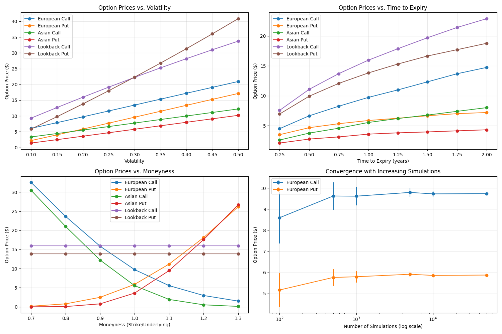
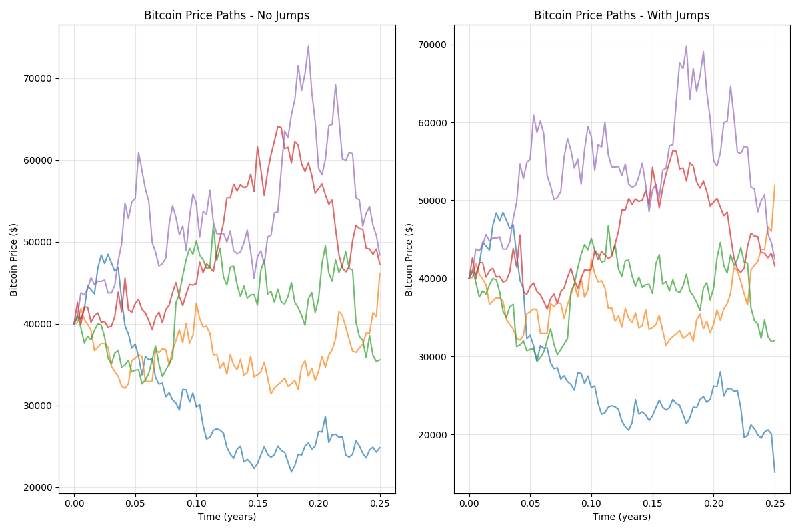

# Monte Carlo Option Pricing

The `monte_carlo_option_pricing` function implements a flexible Monte Carlo simulation approach for pricing various types of options, including European, Asian, and lookback options. This numerical method is particularly valuable for pricing exotic options where closed-form solutions may not exist. The function now also supports jump diffusion for modeling assets with sudden price jumps like cryptocurrencies.

## Usage in Pypulate

```python
from pypulate.asset import monte_carlo_option_pricing

# Calculate price for a standard European call option
result = monte_carlo_option_pricing(
    option_type='european_call',
    underlying_price=100,
    strike_price=100,
    time_to_expiry=1.0,
    risk_free_rate=0.05,
    volatility=0.2,
    simulations=10000,
    time_steps=252,
    dividend_yield=0.01,
    antithetic=True,
    seed=42
)

# Access the results
option_price = result["price"]
standard_error = result["standard_error"]
confidence_interval = result["confidence_interval"]

print(f"Option Price: ${option_price:.2f}")
print(f"Standard Error: ${standard_error:.4f}")
print(f"95% Confidence Interval: [${confidence_interval[0]:.2f}, ${confidence_interval[1]:.2f}]")

# Price a Bitcoin option with jump diffusion
btc_result = monte_carlo_option_pricing(
    option_type='european_call',
    underlying_price=40000,
    strike_price=45000,
    time_to_expiry=0.25,
    risk_free_rate=0.05,
    volatility=0.85,
    simulations=10000,
    time_steps=90,
    jump_intensity=12,    # Expected 12 jumps per year
    jump_mean=-0.05,      # Average jump size (negative for downward bias)
    jump_std=0.15,        # Jump size standard deviation
    seed=42
)

print(f"Bitcoin Option Price: ${btc_result['price']:.2f}")
```

## Parameters

| Parameter | Type | Description | Default |
|-----------|------|-------------|---------|
| `option_type` | str | Type of option ('european_call', 'european_put', 'asian_call', 'asian_put', 'lookback_call', 'lookback_put') | Required |
| `underlying_price` | float | Current price of the underlying asset | Required |
| `strike_price` | float | Strike price of the option | Required |
| `time_to_expiry` | float | Time to expiration in years | Required |
| `risk_free_rate` | float | Risk-free interest rate (annualized) | Required |
| `volatility` | float | Volatility of the underlying asset (annualized) | Required |
| `simulations` | int | Number of Monte Carlo simulations | 10000 |
| `time_steps` | int | Number of time steps in each simulation | 252 |
| `dividend_yield` | float | Continuous dividend yield | 0.0 |
| `antithetic` | bool | Whether to use antithetic variates for variance reduction | True |
| `jump_intensity` | float | Expected number of jumps per year (lambda in Poisson process) | 0.0 |
| `jump_mean` | float | Mean of the jump size distribution | 0.0 |
| `jump_std` | float | Standard deviation of the jump size distribution | 0.0 |
| `seed` | int | Random seed for reproducibility | None |

## Return Value

The function returns a dictionary with the following keys:

| Key | Type | Description |
|-----|------|-------------|
| `price` | float | Calculated option price |
| `standard_error` | float | Standard error of the price estimate |
| `confidence_interval` | tuple | 95% confidence interval for the price (lower, upper) |
| `underlying_price` | float | Price of the underlying asset used in calculation |
| `strike_price` | float | Strike price used in calculation |
| `time_to_expiry` | float | Time to expiration used in calculation |
| `risk_free_rate` | float | Risk-free rate used in calculation |
| `volatility` | float | Volatility used in calculation |
| `simulations` | int | Number of simulations used |
| `time_steps` | int | Number of time steps used |
| `dividend_yield` | float | Dividend yield used in calculation |
| `antithetic` | bool | Whether antithetic variates were used |
| `jump_intensity` | float | Jump intensity used in calculation |
| `jump_mean` | float | Jump mean used in calculation |
| `jump_std` | float | Jump standard deviation used in calculation |

## Option Types

The function supports the following option types:

| Option Type | Description |
|-------------|-------------|
| `european_call` | Standard call option with payoff max(S_T - K, 0) |
| `european_put` | Standard put option with payoff max(K - S_T, 0) |
| `asian_call` | Call option on the average price with payoff max(S_avg - K, 0) |
| `asian_put` | Put option on the average price with payoff max(K - S_avg, 0) |
| `lookback_call` | Call option with payoff S_T - S_min |
| `lookback_put` | Put option with payoff S_max - S_T |

Where:
- S_T is the final price at expiration
- K is the strike price
- S_avg is the average price over the option's life
- S_min is the minimum price over the option's life
- S_max is the maximum price over the option's life

## Jump Diffusion for Volatile Assets

The Monte Carlo option pricing function now supports the Merton jump diffusion model, which is particularly useful for pricing options on highly volatile assets like cryptocurrencies, biotech stocks, or commodities that exhibit both continuous price movements and sudden jumps.

### Jump Diffusion Parameters

- **Jump Intensity (λ)**: The expected number of jumps per year. For example, a value of 12 means we expect an average of 12 jumps per year, or about one per month.

- **Jump Mean (μ<sub>J</sub>)**: The average size of jumps. A negative value indicates a downward bias in jumps, which is common in many assets.

- **Jump Standard Deviation (σ<sub>J</sub>)**: The volatility of jump sizes. Larger values indicate more unpredictable jump magnitudes.

### The Jump Diffusion Model

The standard geometric Brownian motion model is extended with a jump component:

$$dS = (r - q - \lambda \kappa)S dt + \sigma S dW + S dJ$$

Where:
- $S$ is the asset price
- $r$ is the risk-free rate
- $q$ is the dividend yield
- $\sigma$ is the volatility
- $dW$ is a Wiener process increment
- $\lambda$ is the jump intensity
- $\kappa = E[e^J - 1]$ is the expected percentage jump size
- $dJ$ is a compound Poisson process

### Example: Pricing a Bitcoin Option

Bitcoin and other cryptocurrencies are known for their extreme volatility and tendency to experience sudden price jumps. Here's how to price a Bitcoin option using the jump diffusion model:

```python
from pypulate.asset import monte_carlo_option_pricing

# Price a Bitcoin call option with jump diffusion
btc_result = monte_carlo_option_pricing(
    option_type='european_call',
    underlying_price=40000,      # Bitcoin price of $40,000
    strike_price=45000,          # Strike price of $45,000
    time_to_expiry=0.25,         # 3 months to expiry
    risk_free_rate=0.05,
    volatility=0.85,             # Bitcoin has much higher volatility than traditional assets
    simulations=50000,           # More simulations for better accuracy
    time_steps=90,               # Daily steps for 3 months
    jump_intensity=12,           # Expect 12 jumps per year (1 per month on average)
    jump_mean=-0.05,             # Average jump of -5% (downward bias)
    jump_std=0.15,               # Jump size standard deviation of 15%
    seed=42
)

print(f"Bitcoin Option Price: ${btc_result['price']:.2f}")
print(f"95% Confidence Interval: [${btc_result['confidence_interval'][0]:.2f}, ${btc_result['confidence_interval'][1]:.2f}]")
```

### Comparison: Standard vs. Jump Diffusion Model

For assets with significant jump risk, the standard geometric Brownian motion model can underestimate option prices, especially for out-of-the-money options. The jump diffusion model captures the fat-tailed distribution of returns that is characteristic of many volatile assets.

```python
# Standard model (no jumps)
standard_result = monte_carlo_option_pricing(
    option_type='european_call',
    underlying_price=40000,
    strike_price=45000,
    time_to_expiry=0.25,
    risk_free_rate=0.05,
    volatility=0.85,
    simulations=50000,
    time_steps=90,
    seed=42
)

# Jump diffusion model
jump_result = monte_carlo_option_pricing(
    option_type='european_call',
    underlying_price=40000,
    strike_price=45000,
    time_to_expiry=0.25,
    risk_free_rate=0.05,
    volatility=0.85,
    simulations=50000,
    time_steps=90,
    jump_intensity=12,
    jump_mean=-0.05,
    jump_std=0.15,
    seed=42
)

print(f"Standard Model Price: ${standard_result['price']:.2f}")
print(f"Jump Diffusion Model Price: ${jump_result['price']:.2f}")
print(f"Difference: ${jump_result['price'] - standard_result['price']:.2f}")
```

### When to Use Jump Diffusion

Consider using the jump diffusion model when:

1. **The asset exhibits sudden price movements**: Cryptocurrencies, certain commodities, and stocks in volatile sectors.

2. **The returns distribution has fat tails**: When extreme events occur more frequently than a normal distribution would predict.

3. **The asset is subject to significant event risk**: Such as regulatory announcements, earnings surprises, or technological breakthroughs.

4. **You're pricing out-of-the-money options**: Jump diffusion can better capture the probability of extreme price movements that would make these options valuable.

## Comprehensive Example

Here's a complete example demonstrating how to use the Monte Carlo simulation for option pricing and analysis:

```python
import numpy as np
import matplotlib.pyplot as plt
from pypulate.asset import monte_carlo_option_pricing

# Define parameters for analysis
underlying_price = 100
strike_price = 100
time_to_expiry = 1.0
risk_free_rate = 0.05
volatility = 0.2
dividend_yield = 0.01
simulations = 10000
time_steps = 252
seed = 42

# Define option types to analyze
option_types = [
    'european_call', 'european_put', 
    'asian_call', 'asian_put', 
    'lookback_call', 'lookback_put'
]

# Calculate prices for all option types
results = {}
for option_type in option_types:
    result = monte_carlo_option_pricing(
        option_type=option_type,
        underlying_price=underlying_price,
        strike_price=strike_price,
        time_to_expiry=time_to_expiry,
        risk_free_rate=risk_free_rate,
        volatility=volatility,
        dividend_yield=dividend_yield,
        simulations=simulations,
        time_steps=time_steps,
        antithetic=True,
        seed=seed
    )
    results[option_type] = result

# Print results
print("Monte Carlo Option Pricing Results:")
print(f"{'Option Type':<15} {'Price':<10} {'Std Error':<10} {'95% CI':<20}")
print("-" * 55)
for option_type, result in results.items():
    ci_low, ci_high = result['confidence_interval']
    print(f"{option_type:<15} ${result['price']:<9.2f} ${result['standard_error']:<9.4f} [${ci_low:.2f}, ${ci_high:.2f}]")

# Analyze impact of volatility on option prices
volatilities = np.linspace(0.1, 0.5, 9)  # 10% to 50% volatility
vol_prices = {option_type: [] for option_type in option_types}

for vol in volatilities:
    for option_type in option_types:
        result = monte_carlo_option_pricing(
            option_type=option_type,
            underlying_price=underlying_price,
            strike_price=strike_price,
            time_to_expiry=time_to_expiry,
            risk_free_rate=risk_free_rate,
            volatility=vol,
            dividend_yield=dividend_yield,
            simulations=simulations,
            time_steps=time_steps,
            antithetic=True,
            seed=seed
        )
        vol_prices[option_type].append(result['price'])

# Visualize results
plt.figure(figsize=(15, 10))

# Plot option prices
plt.subplot(2, 2, 1)
for option_type in option_types:
    plt.plot(volatilities, vol_prices[option_type], marker='o', label=option_type.replace('_', ' ').title())
plt.grid(True, alpha=0.3)
plt.xlabel('Volatility')
plt.ylabel('Option Price ($)')
plt.title('Option Prices vs. Volatility')
plt.legend()

# Analyze impact of time to expiry
times = np.linspace(0.25, 2.0, 8)  # 3 months to 2 years
time_prices = {option_type: [] for option_type in option_types}

for t in times:
    for option_type in option_types:
        result = monte_carlo_option_pricing(
            option_type=option_type,
            underlying_price=underlying_price,
            strike_price=strike_price,
            time_to_expiry=t,
            risk_free_rate=risk_free_rate,
            volatility=volatility,
            dividend_yield=dividend_yield,
            simulations=simulations,
            time_steps=max(int(t * 252), 10),  # Scale time steps with expiry
            antithetic=True,
            seed=seed
        )
        time_prices[option_type].append(result['price'])

# Plot impact of time to expiry
plt.subplot(2, 2, 2)
for option_type in option_types:
    plt.plot(times, time_prices[option_type], marker='o', label=option_type.replace('_', ' ').title())
plt.grid(True, alpha=0.3)
plt.xlabel('Time to Expiry (years)')
plt.ylabel('Option Price ($)')
plt.title('Option Prices vs. Time to Expiry')
plt.legend()

# Analyze impact of moneyness (strike price relative to underlying)
moneyness_levels = np.linspace(0.7, 1.3, 7)  # 70% to 130% of underlying price
strikes = underlying_price * moneyness_levels
moneyness_prices = {option_type: [] for option_type in option_types[:2]}  # Just European options

for k in strikes:
    for option_type in list(moneyness_prices.keys()):
        result = monte_carlo_option_pricing(
            option_type=option_type,
            underlying_price=underlying_price,
            strike_price=k,
            time_to_expiry=time_to_expiry,
            risk_free_rate=risk_free_rate,
            volatility=volatility,
            dividend_yield=dividend_yield,
            simulations=simulations,
            time_steps=time_steps,
            antithetic=True,
            seed=seed
        )
        moneyness_prices[option_type].append(result['price'])

# Plot impact of moneyness
plt.subplot(2, 2, 3)
for option_type in moneyness_prices.keys():
    plt.plot(moneyness_levels, moneyness_prices[option_type], marker='o', label=option_type.replace('_', ' ').title())
plt.grid(True, alpha=0.3)
plt.xlabel('Moneyness (Strike/Underlying)')
plt.ylabel('Option Price ($)')
plt.title('Option Prices vs. Moneyness')
plt.legend()

# Analyze impact of jump parameters on Bitcoin option
jump_intensities = np.linspace(0, 24, 9)  # 0 to 24 jumps per year
jump_prices = []

for intensity in jump_intensities:
    result = monte_carlo_option_pricing(
        option_type='european_call',
        underlying_price=40000,
        strike_price=45000,
        time_to_expiry=0.25,
        risk_free_rate=0.05,
        volatility=0.85,
        simulations=10000,
        time_steps=90,
        jump_intensity=intensity,
        jump_mean=-0.05,
        jump_std=0.15,
        seed=seed
    )
    jump_prices.append(result['price'])

# Plot impact of jump intensity
plt.subplot(2, 2, 4)
plt.plot(jump_intensities, jump_prices, 'r-', marker='o', linewidth=2)
plt.grid(True, alpha=0.3)
plt.xlabel('Jump Intensity (jumps per year)')
plt.ylabel('Option Price ($)')
plt.title('Bitcoin Option Price vs. Jump Intensity')

plt.tight_layout()
plt.show()

# Generate and visualize sample price paths
np.random.seed(seed)
sample_paths = 5
dt = time_to_expiry / time_steps
drift = (risk_free_rate - dividend_yield - 0.5 * volatility**2) * dt
vol_sqrt_dt = volatility * np.sqrt(dt)

# Initialize price paths
paths = np.zeros((sample_paths, time_steps + 1))
paths[:, 0] = underlying_price

# Generate random samples
random_samples = np.random.normal(0, 1, (sample_paths, time_steps))

# Simulate price paths
for t in range(1, time_steps + 1):
    paths[:, t] = paths[:, t-1] * np.exp(drift + vol_sqrt_dt * random_samples[:, t-1])

# Create time array
time_array = np.linspace(0, time_to_expiry, time_steps + 1)

# Plot sample price paths
plt.figure(figsize=(10, 6))
for i in range(sample_paths):
    plt.plot(time_array, paths[i, :], alpha=0.7)
plt.axhline(y=strike_price, color='r', linestyle='--', label='Strike Price')
plt.grid(True, alpha=0.3)
plt.xlabel('Time (years)')
plt.ylabel('Asset Price ($)')
plt.title(f'Sample Price Paths (S₀=${underlying_price}, K=${strike_price}, σ={volatility:.1f})')
plt.legend()
plt.show()

# Generate and visualize Bitcoin price paths with jumps
np.random.seed(seed)
btc_price = 40000
btc_vol = 0.85
btc_time = 0.25
btc_steps = 90
btc_drift = (risk_free_rate - 0.5 * btc_vol**2) * (btc_time / btc_steps)
btc_vol_sqrt_dt = btc_vol * np.sqrt(btc_time / btc_steps)
jump_intensity = 12
jump_mean = -0.05
jump_std = 0.15

# Initialize price paths
btc_paths_no_jumps = np.zeros((sample_paths, btc_steps + 1))
btc_paths_with_jumps = np.zeros((sample_paths, btc_steps + 1))
btc_paths_no_jumps[:, 0] = btc_price
btc_paths_with_jumps[:, 0] = btc_price

# Generate random samples
btc_random_samples = np.random.normal(0, 1, (sample_paths, btc_steps))

# Simulate price paths
for t in range(1, btc_steps + 1):
    # Without jumps
    btc_paths_no_jumps[:, t] = btc_paths_no_jumps[:, t-1] * np.exp(btc_drift + btc_vol_sqrt_dt * btc_random_samples[:, t-1])
    
    # With jumps
    btc_paths_with_jumps[:, t] = btc_paths_with_jumps[:, t-1] * np.exp(btc_drift + btc_vol_sqrt_dt * btc_random_samples[:, t-1])
    
    # Add jumps
    lambda_dt = jump_intensity * (btc_time / btc_steps)
    for i in range(sample_paths):
        jump_count = np.random.poisson(lambda_dt)
        if jump_count > 0:
            jump_sizes = np.random.normal(jump_mean, jump_std, jump_count)
            total_jump = np.sum(jump_sizes)
            btc_paths_with_jumps[i, t] *= np.exp(total_jump)

# Create time array
btc_time_array = np.linspace(0, btc_time, btc_steps + 1)

# Plot Bitcoin price paths
plt.figure(figsize=(12, 8))
plt.subplot(1, 2, 1)
for i in range(sample_paths):
    plt.plot(btc_time_array, btc_paths_no_jumps[i, :], alpha=0.7)
plt.grid(True, alpha=0.3)
plt.xlabel('Time (years)')
plt.ylabel('Bitcoin Price ($)')
plt.title('Bitcoin Price Paths - No Jumps')

plt.subplot(1, 2, 2)
for i in range(sample_paths):
    plt.plot(btc_time_array, btc_paths_with_jumps[i, :], alpha=0.7)
plt.grid(True, alpha=0.3)
plt.xlabel('Time (years)')
plt.ylabel('Bitcoin Price ($)')
plt.title('Bitcoin Price Paths - With Jumps')

plt.tight_layout()
plt.show()
```

## Example Output

```
Monte Carlo Option Pricing Results:
Option Type     Price      Std Error  95% CI              
-------------------------------------------------------
european_call   $9.73      $0.1428    [$9.45, $10.01]
european_put    $5.86      $0.0891    [$5.69, $6.03]
asian_call      $5.53      $0.0791    [$5.38, $5.69]
asian_put       $3.58      $0.0549    [$3.48, $3.69]
lookback_call   $15.95     $0.1418    [$15.67, $16.23]
lookback_put    $13.82     $0.0996    [$13.62, $14.01]
```

## Visualizations

### Option Prices vs. Volatility

This chart shows how option prices change with volatility for different option types. All option prices increase with volatility, but at different rates.




### Option Prices vs. Time to Expiry

This chart illustrates how option prices change with time to expiration. European and Asian options typically increase with time, while lookback options show a more pronounced increase.

### Option Prices vs. Moneyness

This chart demonstrates how call and put option prices change with moneyness (strike price relative to underlying price). Call options decrease with increasing strike price, while put options increase.

### Bitcoin Option Price vs. Jump Intensity

This chart shows how the price of a Bitcoin option increases with jump intensity, reflecting the higher risk premium required for assets with more frequent jumps.




### Sample Price Paths

These charts display sample price paths generated by the Monte Carlo simulation, illustrating the difference between standard geometric Brownian motion and jump diffusion models.

## Theoretical Background

The Monte Carlo method for option pricing is based on the risk-neutral valuation principle, which states that the price of an option is the expected value of its future payoff, discounted at the risk-free rate.

For the standard model, the underlying asset price follows geometric Brownian motion.

## Variance Reduction Techniques

The implementation uses antithetic variates as a variance reduction technique. This method generates pairs of negatively correlated paths by using both $Z$ and $-Z$ in the simulation, which helps reduce the standard error of the price estimate.

## Practical Applications

Monte Carlo option pricing is used for:

1. **Exotic Option Pricing**: Valuing options with complex payoff structures
2. **Path-Dependent Options**: Pricing options whose payoff depends on the price path (e.g., Asian, lookback)
3. **Multi-Asset Options**: Valuing options on multiple underlying assets
4. **Risk Management**: Assessing option portfolio risk under various scenarios
5. **Model Validation**: Benchmarking against closed-form solutions where available
6. **Sensitivity Analysis**: Analyzing option price sensitivity to various parameters
7. **Cryptocurrency Options**: Pricing options on highly volatile digital assets using jump diffusion

## Limitations

The Monte Carlo method has several limitations:

1. **Computational Intensity**: Requires many simulations for accurate pricing
2. **Convergence Rate**: Converges relatively slowly (error decreases with $1/\sqrt{n}$)
3. **Model Risk**: Results depend on the assumed price process
4. **Parameter Sensitivity**: Sensitive to volatility and other input parameters
5. **Early Exercise**: Basic implementation doesn't handle American options
6. **Greeks Calculation**: Calculating Greeks requires additional techniques
7. **Jump Parameter Estimation**: For jump diffusion, accurately estimating jump parameters can be challenging

## Extensions

Several extensions to the basic Monte Carlo method address its limitations:

1. **Quasi-Monte Carlo**: Using low-discrepancy sequences for faster convergence
2. **Additional Variance Reduction**: Control variates, importance sampling, stratified sampling
3. **American Option Pricing**: Least-squares Monte Carlo (Longstaff-Schwartz method)
4. **Greeks Calculation**: Pathwise derivatives, likelihood ratio method
5. **Jump Diffusion**: Incorporating jumps in the price process (implemented)
6. **Stochastic Volatility**: Allowing for time-varying volatility
7. **Local Volatility**: Using volatility that depends on both time and asset price
8. **Multi-Factor Models**: Incorporating multiple sources of uncertainty 