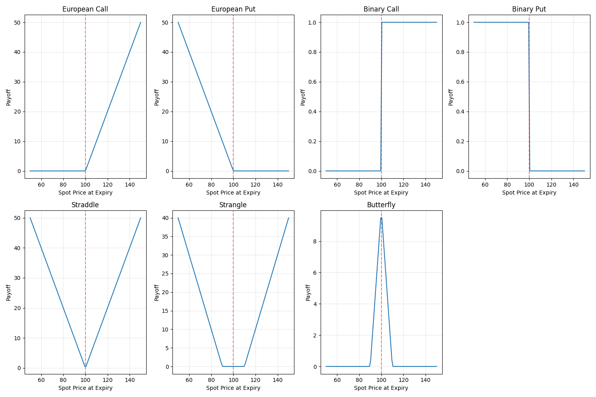
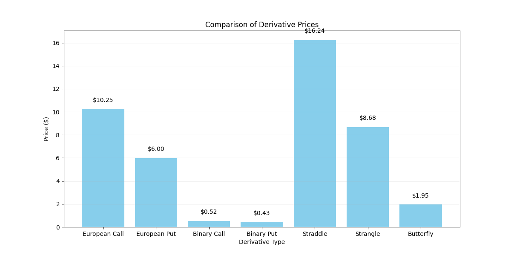

# Risk-Neutral Valuation

The `risk_neutral_valuation` function implements a flexible Monte Carlo simulation approach for pricing derivatives using the risk-neutral valuation principle. This function allows you to price any derivative by providing a custom payoff function, making it extremely versatile for various financial instruments.

## Usage in Pypulate

```python
from pypulate.asset import risk_neutral_valuation

# Define a call option payoff function
def call_payoff(s, k=100):
    return max(0, s - k)

# Price a call option
result = risk_neutral_valuation(
    payoff_function=call_payoff,
    underlying_price=100,
    risk_free_rate=0.05,
    volatility=0.2,
    time_to_expiry=1.0,
    steps=1000,
    simulations=10000,
    dividend_yield=0.0,
    seed=42
)

# Access the results
option_price = result["price"]
standard_error = result["standard_error"]
confidence_interval = result["confidence_interval"]

print(f"Option Price: ${option_price:.2f}")
print(f"Standard Error: ${standard_error:.4f}")
print(f"95% Confidence Interval: [${confidence_interval[0]:.2f}, ${confidence_interval[1]:.2f}]")
```

## Parameters

| Parameter | Type | Description | Default |
|-----------|------|-------------|---------|
| `payoff_function` | callable | Function that takes the final underlying price and returns the payoff | Required |
| `underlying_price` | float | Current price of the underlying asset | Required |
| `risk_free_rate` | float | Risk-free interest rate (annualized) | Required |
| `volatility` | float | Volatility of the underlying asset (annualized) | Required |
| `time_to_expiry` | float | Time to expiration in years | Required |
| `steps` | int | Number of time steps in the simulation | 1000 |
| `simulations` | int | Number of Monte Carlo simulations | 10000 |
| `dividend_yield` | float | Continuous dividend yield | 0.0 |
| `seed` | int | Random seed for reproducibility | None |

## Return Value

The function returns a dictionary with the following keys:

| Key | Type | Description |
|-----|------|-------------|
| `price` | float | Calculated derivative price |
| `standard_error` | float | Standard error of the price estimate |
| `confidence_interval` | tuple | 95% confidence interval for the price (lower, upper) |
| `underlying_price` | float | Price of the underlying asset used in calculation |
| `risk_free_rate` | float | Risk-free rate used in calculation |
| `volatility` | float | Volatility used in calculation |
| `time_to_expiry` | float | Time to expiration used in calculation |
| `steps` | int | Number of time steps used |
| `simulations` | int | Number of simulations used |
| `dividend_yield` | float | Dividend yield used in calculation |
| `price_statistics` | dict | Statistics about the simulated final prices (mean, std, min, max, median) |
| `payoff_statistics` | dict | Statistics about the payoffs (mean, std, min, max, median, zero_proportion) |

## Risk Level Classification

The risk level of a derivative can be classified based on its price volatility relative to the underlying asset:

| Risk Level | Description | Volatility Ratio |
|------------|-------------|-----------------|
| Very Low | Minimal price fluctuation relative to underlying | < 0.5 |
| Low | Limited price fluctuation relative to underlying | 0.5 - 1.0 |
| Moderate | Similar price fluctuation to underlying | 1.0 - 1.5 |
| High | Greater price fluctuation than underlying | 1.5 - 2.5 |
| Very High | Significantly greater price fluctuation than underlying | > 2.5 |

Where the volatility ratio is calculated as: (Payoff Standard Deviation / Mean Final Price) / (Underlying Volatility)

## Comprehensive Example

Here's a complete example demonstrating how to use risk-neutral valuation for various derivative types and analysis:

```python
import numpy as np
import matplotlib.pyplot as plt
from pypulate.asset import risk_neutral_valuation

# Define parameters for analysis
underlying_price = 100
strike_price = 100
risk_free_rate = 0.05
volatility = 0.2
time_to_expiry = 1.0
dividend_yield = 0.01
steps = 100
simulations = 1000
seed = 42

# Define different payoff functions
def european_call(s, k=strike_price):
    return max(0, s - k)

def european_put(s, k=strike_price):
    return max(0, k - s)

def binary_call(s, k=strike_price):
    return 1 if s > k else 0

def binary_put(s, k=strike_price):
    return 1 if s < k else 0

def straddle(s, k=strike_price):
    return abs(s - k)

def strangle(s, k1=strike_price-10, k2=strike_price+10):
    return max(0, s - k2) + max(0, k1 - s)

def butterfly(s, k=strike_price, width=10):
    return max(0, s - (k-width)) - 2*max(0, s - k) + max(0, s - (k+width))

# Dictionary of payoff functions
payoff_functions = {
    "European Call": european_call,
    "European Put": european_put,
    "Binary Call": binary_call,
    "Binary Put": binary_put,
    "Straddle": straddle,
    "Strangle": strangle,
    "Butterfly": butterfly
}

# Calculate prices for all derivative types
results = {}
for name, payoff_function in payoff_functions.items():
    result = risk_neutral_valuation(
        payoff_function=payoff_function,
        underlying_price=underlying_price,
        risk_free_rate=risk_free_rate,
        volatility=volatility,
        time_to_expiry=time_to_expiry,
        steps=steps,
        simulations=simulations,
        dividend_yield=dividend_yield,
        seed=seed
    )
    results[name] = result

# Print results
print("Risk-Neutral Valuation Results:")
print(f"{'Derivative Type':<15} {'Price':<10} {'Std Error':<10} {'95% CI':<20}")
print("-" * 55)
for name, result in results.items():
    ci_low, ci_high = result['confidence_interval']
    print(f"{name:<15} ${result['price']:<9.2f} ${result['standard_error']:<9.4f} [${ci_low:.2f}, ${ci_high:.2f}]")

# Analyze impact of volatility on derivative prices
volatilities = np.linspace(0.1, 0.5, 9)  # 10% to 50% volatility
vol_prices = {name: [] for name in payoff_functions.keys()}

for vol in volatilities:
    for name, payoff_function in payoff_functions.items():
        result = risk_neutral_valuation(
            payoff_function=payoff_function,
            underlying_price=underlying_price,
            risk_free_rate=risk_free_rate,
            volatility=vol,
            time_to_expiry=time_to_expiry,
            steps=steps,
            simulations=simulations,
            dividend_yield=dividend_yield,
            seed=seed
        )
        vol_prices[name].append(result['price'])

# Visualize results
plt.figure(figsize=(15, 10))

# Plot derivative prices vs volatility
plt.subplot(2, 2, 1)
for name, prices in vol_prices.items():
    plt.plot(volatilities, prices, marker='o', label=name)
plt.grid(True, alpha=0.3)
plt.xlabel('Volatility')
plt.ylabel('Derivative Price ($)')
plt.title('Derivative Prices vs. Volatility')
plt.legend()

# Analyze impact of time to expiry
times = np.linspace(0.25, 2.0, 8)  # 3 months to 2 years
time_prices = {name: [] for name in payoff_functions.keys()}

for t in times:
    for name, payoff_function in payoff_functions.items():
        result = risk_neutral_valuation(
            payoff_function=payoff_function,
            underlying_price=underlying_price,
            risk_free_rate=risk_free_rate,
            volatility=volatility,
            time_to_expiry=t,
            steps=max(int(t * 1000), 10),  # Scale time steps with expiry
            simulations=simulations,
            dividend_yield=dividend_yield,
            seed=seed
        )
        time_prices[name].append(result['price'])

# Plot impact of time to expiry
plt.subplot(2, 2, 2)
for name, prices in time_prices.items():
    plt.plot(times, prices, marker='o', label=name)
plt.grid(True, alpha=0.3)
plt.xlabel('Time to Expiry (years)')
plt.ylabel('Derivative Price ($)')
plt.title('Derivative Prices vs. Time to Expiry')
plt.legend()

# Analyze impact of moneyness (strike price relative to underlying)
moneyness_levels = np.linspace(0.7, 1.3, 7)  # 70% to 130% of underlying price
strikes = underlying_price * moneyness_levels
moneyness_prices = {name: [] for name in ["European Call", "European Put"]}  # Just analyze these two

for k in strikes:
    for name in moneyness_prices.keys():
        if name == "European Call":
            payoff_function = lambda s, k=k: max(0, s - k)
        else:  # European Put
            payoff_function = lambda s, k=k: max(0, k - s)
            
        result = risk_neutral_valuation(
            payoff_function=payoff_function,
            underlying_price=underlying_price,
            risk_free_rate=risk_free_rate,
            volatility=volatility,
            time_to_expiry=time_to_expiry,
            steps=steps,
            simulations=simulations,
            dividend_yield=dividend_yield,
            seed=seed
        )
        moneyness_prices[name].append(result['price'])

# Plot impact of moneyness
plt.subplot(2, 2, 3)
for name, prices in moneyness_prices.items():
    plt.plot(moneyness_levels, prices, marker='o', label=name)
plt.grid(True, alpha=0.3)
plt.xlabel('Moneyness (Strike/Underlying)')
plt.ylabel('Option Price ($)')
plt.title('Option Prices vs. Moneyness')
plt.legend()

# Analyze convergence with increasing simulations
sim_counts = [100, 500, 1000, 5000, 10000, 50000]
convergence = {name: {'prices': [], 'errors': []} for name in ["European Call", "European Put"]}

for sim_count in sim_counts:
    for name in convergence.keys():
        if name == "European Call":
            payoff_function = european_call
        else:  # European Put
            payoff_function = european_put
            
        result = risk_neutral_valuation(
            payoff_function=payoff_function,
            underlying_price=underlying_price,
            risk_free_rate=risk_free_rate,
            volatility=volatility,
            time_to_expiry=time_to_expiry,
            steps=steps,
            simulations=sim_count,
            dividend_yield=dividend_yield,
            seed=seed
        )
        convergence[name]['prices'].append(result['price'])
        convergence[name]['errors'].append(result['standard_error'])

# Plot convergence
plt.subplot(2, 2, 4)
for name in convergence.keys():
    plt.errorbar(
        sim_counts, 
        convergence[name]['prices'], 
        yerr=convergence[name]['errors'],
        marker='o', 
        label=name
    )
plt.xscale('log')
plt.grid(True, alpha=0.3)
plt.xlabel('Number of Simulations (log scale)')
plt.ylabel('Option Price ($)')
plt.title('Convergence with Increasing Simulations')
plt.legend()

plt.tight_layout()
plt.show()

# Generate and visualize sample price paths
np.random.seed(seed)
sample_paths = 5
dt = time_to_expiry / steps
drift = (risk_free_rate - dividend_yield - 0.5 * volatility**2) * dt
vol_sqrt_dt = volatility * np.sqrt(dt)

# Initialize price paths
paths = np.zeros((sample_paths, steps + 1))
paths[:, 0] = underlying_price

# Generate random samples
random_samples = np.random.normal(0, 1, (sample_paths, steps))

# Simulate price paths
for t in range(1, steps + 1):
    paths[:, t] = paths[:, t-1] * np.exp(drift + vol_sqrt_dt * random_samples[:, t-1])

# Create time array
time_array = np.linspace(0, time_to_expiry, steps + 1)

# Plot sample price paths
plt.figure(figsize=(10, 6))
for i in range(sample_paths):
    plt.plot(time_array, paths[i, :], alpha=0.7)
plt.axhline(y=strike_price, color='r', linestyle='--', label='Strike Price')
plt.grid(True, alpha=0.3)
plt.xlabel('Time (years)')
plt.ylabel('Asset Price ($)')
plt.title(f'Sample Price Paths (S₀=${underlying_price}, K=${strike_price}, σ={volatility:.1f})')
plt.legend()
plt.show()

# Visualize payoff functions
spot_prices = np.linspace(50, 150, 100)
payoffs = {name: [func(s) for s in spot_prices] for name, func in payoff_functions.items()}

plt.figure(figsize=(15, 10))
for i, (name, values) in enumerate(payoffs.items()):
    plt.subplot(2, 4, i+1)
    plt.plot(spot_prices, values)
    plt.axvline(x=strike_price, color='r', linestyle='--', alpha=0.5)
    plt.grid(True, alpha=0.3)
    plt.xlabel('Spot Price at Expiry')
    plt.ylabel('Payoff')
    plt.title(name)

plt.tight_layout()
plt.show()

# Compare derivative prices
derivative_names = list(results.keys())
prices = [results[name]['price'] for name in derivative_names]

plt.figure(figsize=(12, 6))
bars = plt.bar(derivative_names, prices, color='skyblue')
plt.grid(True, alpha=0.3, axis='y')
plt.xlabel('Derivative Type')
plt.ylabel('Price ($)')
plt.title('Comparison of Derivative Prices')

# Add price labels on top of bars
for bar in bars:
    height = bar.get_height()
    plt.text(bar.get_x() + bar.get_width()/2., height + 0.5,
             f'${height:.2f}', ha='center', va='bottom')

plt.show()
```

## Example Output

```
Risk-Neutral Valuation Results:
Derivative Type Price      Std Error  95% CI              
-------------------------------------------------------
European Call   $10.25     $0.4843    [$9.30, $11.20]
European Put    $6.00      $0.2929    [$5.42, $6.57]
Binary Call     $0.52      $0.0150    [$0.49, $0.55]
Binary Put      $0.43      $0.0150    [$0.41, $0.46]
Straddle        $16.24     $0.4443    [$15.37, $17.11]
Strangle        $8.68      $0.3933    [$7.91, $9.45]
Butterfly       $1.95      $0.0943    [$1.76, $2.13]
```

## Visualizations

### Derivative Prices vs. Volatility

This chart shows how derivative prices change with volatility. Options like calls, puts, and straddles increase with volatility, while binary options show less sensitivity.




### Derivative Prices vs. Time to Expiry

This chart illustrates how derivative prices change with time to expiration. European options typically increase with time, while binary options may decrease.


### Option Prices vs. Moneyness

This chart demonstrates how call and put option prices change with moneyness (strike price relative to underlying price). Call options decrease with increasing strike price, while put options increase.

### Convergence with Increasing Simulations

This chart shows how derivative price estimates converge and standard errors decrease as the number of simulations increases.

### Sample Price Paths

This chart displays sample price paths generated by the Monte Carlo simulation, illustrating the stochastic nature of asset price movements.

### Payoff Functions

These charts visualize the payoff functions for different derivative types at expiration, showing how the payoff varies with the final underlying price.

### Comparison of Derivative Prices

This bar chart compares the prices of different derivative types under the same market conditions, highlighting their relative values.




## Theoretical Background

Risk-neutral valuation is based on the fundamental principle that in a risk-neutral world, all assets earn the risk-free rate, and the price of a derivative is the expected value of its future payoff, discounted at the risk-free rate.


## Practical Applications

Risk-neutral valuation is used for:

1. **Exotic Derivative Pricing**: Valuing derivatives with complex payoff structures
2. **Path-Dependent Derivatives**: Pricing derivatives whose payoff depends on the price path
3. **Multi-Asset Derivatives**: Valuing derivatives on multiple underlying assets
4. **Risk Management**: Assessing derivative portfolio risk under various scenarios
5. **Model Validation**: Benchmarking against closed-form solutions where available
6. **Sensitivity Analysis**: Analyzing derivative price sensitivity to various parameters
7. **Structured Products**: Pricing complex financial products with embedded derivatives
8. **Real Options**: Valuing real investment opportunities with option-like characteristics

## Limitations

The risk-neutral valuation method has several limitations:

1. **Computational Intensity**: Requires many simulations for accurate pricing
2. **Convergence Rate**: Converges relatively slowly (error decreases with 1/√n)
3. **Model Risk**: Results depend on the assumed price process
4. **Parameter Sensitivity**: Sensitive to volatility and other input parameters
5. **Early Exercise**: Basic implementation doesn't handle American options
6. **Greeks Calculation**: Calculating Greeks requires additional techniques

## Extensions

Several extensions to the basic risk-neutral valuation method address its limitations:

1. **Quasi-Monte Carlo**: Using low-discrepancy sequences for faster convergence
2. **Additional Variance Reduction**: Control variates, importance sampling, stratified sampling
3. **American Option Pricing**: Least-squares Monte Carlo (Longstaff-Schwartz method)
4. **Greeks Calculation**: Pathwise derivatives, likelihood ratio method
5. **Jump Diffusion**: Incorporating jumps in the price process
6. **Stochastic Volatility**: Allowing for time-varying volatility
7. **Local Volatility**: Using volatility that depends on both time and asset price
8. **Multi-Factor Models**: Incorporating multiple sources of uncertainty 