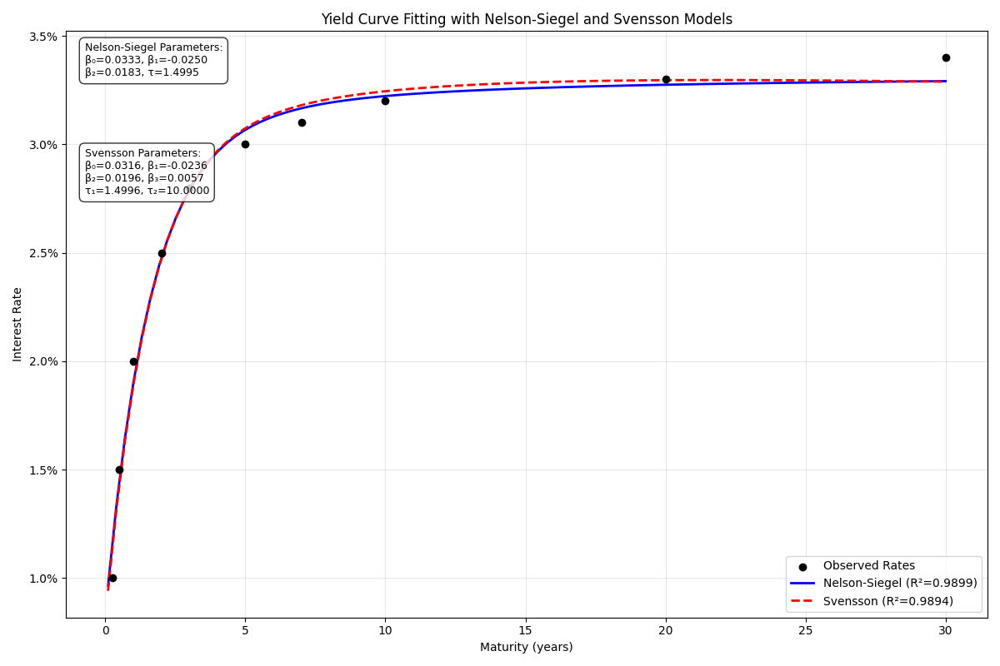
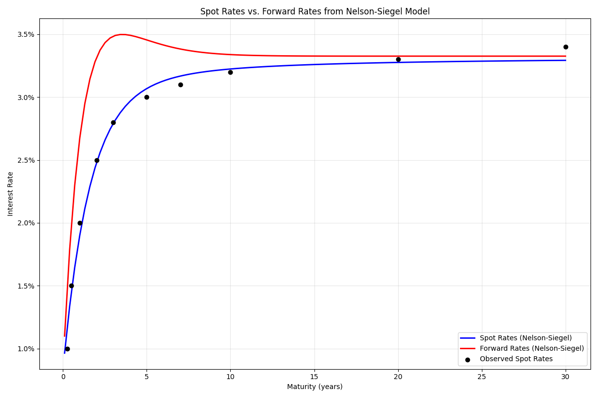

# Term Structure Models

The term structure module provides functions for fitting yield curve models to market data. These models are essential for understanding the relationship between interest rates and maturities, which is crucial for bond pricing, risk management, and monetary policy analysis.

## Models Available

Pypulate implements two widely-used parametric models for yield curve fitting:

1. **Nelson-Siegel Model**: A three-factor model that can capture monotonic, humped, and S-shaped yield curves.
2. **Svensson Model**: An extension of the Nelson-Siegel model with an additional factor to better fit complex yield curve shapes.

## Usage in Pypulate

```python
from pypulate.asset import nelson_siegel, svensson

# Sample yield curve data
maturities = [0.25, 0.5, 1, 2, 3, 5, 7, 10, 20, 30]  # in years
rates = [0.01, 0.015, 0.02, 0.025, 0.028, 0.03, 0.031, 0.032, 0.033, 0.034]  # as decimals

# Fit the Nelson-Siegel model
ns_result = nelson_siegel(maturities, rates)

# Get the fitted parameters
beta0, beta1, beta2, tau = ns_result['parameters']
print(f"Nelson-Siegel parameters:")
print(f"β₀ (long-term rate): {beta0:.4f}")
print(f"β₁ (short-term component): {beta1:.4f}")
print(f"β₂ (medium-term component): {beta2:.4f}")
print(f"τ (time decay factor): {tau:.4f}")

# Predict rates at specific maturities
predict_ns = ns_result['predict_func']
rate_4y = predict_ns(4)
print(f"Predicted 4-year rate: {rate_4y:.2%}")

# Fit the Svensson model (for more complex yield curves)
sv_result = svensson(maturities, rates)

# Get the fitted parameters
beta0, beta1, beta2, beta3, tau1, tau2 = sv_result['parameters']
print(f"\nSvensson parameters:")
print(f"β₀ (long-term rate): {beta0:.4f}")
print(f"β₁ (short-term component): {beta1:.4f}")
print(f"β₂ (medium-term component): {beta2:.4f}")
print(f"β₃ (additional medium-term component): {beta3:.4f}")
print(f"τ₁ (first time decay factor): {tau1:.4f}")
print(f"τ₂ (second time decay factor): {tau2:.4f}")

# Predict rates using the Svensson model
predict_sv = sv_result['predict_func']
rate_4y_sv = predict_sv(4)
print(f"Predicted 4-year rate (Svensson): {rate_4y_sv:.2%}")

# Compare model fit
print(f"\nModel fit comparison:")
print(f"Nelson-Siegel R²: {ns_result['r_squared']:.4f}, RMSE: {ns_result['rmse']:.6f}")
print(f"Svensson R²: {sv_result['r_squared']:.4f}, RMSE: {sv_result['rmse']:.6f}")
```

## Nelson-Siegel Model

### Parameters

| Parameter | Type | Description | Default |
|-----------|------|-------------|---------|
| `maturities` | list of float | Maturities in years for the observed rates | Required |
| `rates` | list of float | Observed interest rates (as decimals) | Required |
| `initial_params` | list of float | Initial parameters [β₀, β₁, β₂, τ] | [0.03, -0.02, -0.01, 1.5] |

### Return Value

The `nelson_siegel` function returns a dictionary with the following keys:

| Key | Type | Description |
|-----|------|-------------|
| `parameters` | list of float | Fitted parameters [β₀, β₁, β₂, τ] |
| `parameter_names` | list of str | Names of the parameters ["beta0", "beta1", "beta2", "tau"] |
| `predict_func` | callable | Function that takes a maturity and returns the predicted rate |
| `fitted_rates` | list of float | Predicted rates at the input maturities |
| `residuals` | list of float | Differences between observed and fitted rates |
| `r_squared` | float | Coefficient of determination (goodness of fit) |
| `rmse` | float | Root mean square error |
| `short_rate` | float | Estimated short-term interest rate |
| `long_rate` | float | Estimated long-term interest rate (equals β₀) |
| `maturities` | list of float | Input maturities |
| `rates` | list of float | Input rates |

### Model Formula

The Nelson-Siegel model is defined by the following equation:

$$r(t) = \beta_0 + \beta_1 \cdot \frac{1 - e^{-t/\tau}}{t/\tau} + \beta_2 \cdot \left(\frac{1 - e^{-t/\tau}}{t/\tau} - e^{-t/\tau}\right)$$

Where:
- $r(t)$ is the interest rate at maturity $t$
- $\beta_0$ represents the long-term interest rate
- $\beta_1$ represents the short-term component
- $\beta_2$ represents the medium-term component
- $\tau$ is the time decay factor that determines the rate at which the short and medium-term components decay

## Svensson Model

### Parameters

| Parameter | Type | Description | Default |
|-----------|------|-------------|---------|
| `maturities` | list of float | Maturities in years for the observed rates | Required |
| `rates` | list of float | Observed interest rates (as decimals) | Required |
| `initial_params` | list of float | Initial parameters [β₀, β₁, β₂, β₃, τ₁, τ₂] | [0.03, -0.02, -0.01, 0.01, 1.5, 10] |

### Return Value

The `svensson` function returns a dictionary with the following keys:

| Key | Type | Description |
|-----|------|-------------|
| `parameters` | list of float | Fitted parameters [β₀, β₁, β₂, β₃, τ₁, τ₂] |
| `parameter_names` | list of str | Names of the parameters ["beta0", "beta1", "beta2", "beta3", "tau1", "tau2"] |
| `predict_func` | callable | Function that takes a maturity and returns the predicted rate |
| `fitted_rates` | list of float | Predicted rates at the input maturities |
| `residuals` | list of float | Differences between observed and fitted rates |
| `r_squared` | float | Coefficient of determination (goodness of fit) |
| `rmse` | float | Root mean square error |
| `short_rate` | float | Estimated short-term interest rate |
| `long_rate` | float | Estimated long-term interest rate (equals β₀) |
| `maturities` | list of float | Input maturities |
| `rates` | list of float | Input rates |

### Model Formula

The Svensson model extends the Nelson-Siegel model with an additional term:

$$r(t) = \beta_0 + \beta_1 \cdot \frac{1 - e^{-t/\tau_1}}{t/\tau_1} + \beta_2 \cdot \left(\frac{1 - e^{-t/\tau_1}}{t/\tau_1} - e^{-t/\tau_1}\right) + \beta_3 \cdot \left(\frac{1 - e^{-t/\tau_2}}{t/\tau_2} - e^{-t/\tau_2}\right)$$

Where:
- $r(t)$ is the interest rate at maturity $t$
- $\beta_0$ represents the long-term interest rate
- $\beta_1$ represents the short-term component
- $\beta_2$ and $\beta_3$ represent medium-term components
- $\tau_1$ and $\tau_2$ are time decay factors

## Model Selection

| Model | Complexity | Data Points Required | Best Used For |
|-------|------------|----------------------|--------------|
| Nelson-Siegel | Lower (4 parameters) | At least 4 | Simple yield curves with one hump |
| Svensson | Higher (6 parameters) | At least 6 | Complex yield curves with multiple humps |

## Comprehensive Example

Here's a complete example demonstrating how to fit yield curve models and visualize the results:

```python
import numpy as np
import matplotlib.pyplot as plt
from pypulate.asset import nelson_siegel, svensson

# Sample yield curve data (US Treasury yields as of a sample date)
maturities = [0.25, 0.5, 1, 2, 3, 5, 7, 10, 20, 30]
rates = [0.01, 0.015, 0.02, 0.025, 0.028, 0.03, 0.031, 0.032, 0.033, 0.034]

# Fit both models
ns_result = nelson_siegel(maturities, rates)
sv_result = svensson(maturities, rates)

# Create a dense set of maturities for smooth curve plotting
dense_maturities = np.linspace(0.1, 30, 100)

# Get predicted rates for both models
ns_rates = [ns_result['predict_func'](t) for t in dense_maturities]
sv_rates = [sv_result['predict_func'](t) for t in dense_maturities]

# Plot the results
plt.figure(figsize=(12, 8))

# Plot the actual data points
plt.scatter(maturities, rates, color='black', label='Observed Rates', zorder=3)

# Plot the fitted curves
plt.plot(dense_maturities, ns_rates, 'b-', label=f'Nelson-Siegel (R²={ns_result["r_squared"]:.4f})', linewidth=2)
plt.plot(dense_maturities, sv_rates, 'r--', label=f'Svensson (R²={sv_result["r_squared"]:.4f})', linewidth=2)

# Add labels and title
plt.xlabel('Maturity (years)')
plt.ylabel('Interest Rate')
plt.title('Yield Curve Fitting with Nelson-Siegel and Svensson Models')
plt.grid(True, alpha=0.3)
plt.legend()

# Format y-axis as percentage
plt.gca().yaxis.set_major_formatter(plt.FuncFormatter(lambda x, _: f'{x:.1%}'))

# Add annotations for model parameters
ns_params = ns_result['parameters']
sv_params = sv_result['parameters']

ns_text = f"Nelson-Siegel Parameters:\nβ₀={ns_params[0]:.4f}, β₁={ns_params[1]:.4f}\nβ₂={ns_params[2]:.4f}, τ={ns_params[3]:.4f}"
sv_text = f"Svensson Parameters:\nβ₀={sv_params[0]:.4f}, β₁={sv_params[1]:.4f}\nβ₂={sv_params[2]:.4f}, β₃={sv_params[3]:.4f}\nτ₁={sv_params[4]:.4f}, τ₂={sv_params[5]:.4f}"

plt.annotate(ns_text, xy=(0.02, 0.98), xycoords='axes fraction', 
             bbox=dict(boxstyle="round,pad=0.5", fc="white", alpha=0.8),
             va='top', fontsize=9)

plt.annotate(sv_text, xy=(0.02, 0.80), xycoords='axes fraction', 
             bbox=dict(boxstyle="round,pad=0.5", fc="white", alpha=0.8),
             va='top', fontsize=9)

plt.tight_layout()
plt.show()

# Analyze the components of the Nelson-Siegel model
beta0, beta1, beta2, tau = ns_result['parameters']

# Calculate the three components
component1 = np.ones_like(dense_maturities) * beta0  # Long-term component
component2 = beta1 * (1 - np.exp(-dense_maturities / tau)) / (dense_maturities / tau)  # Short-term component
component3 = beta2 * ((1 - np.exp(-dense_maturities / tau)) / (dense_maturities / tau) - np.exp(-dense_maturities / tau))  # Medium-term component

# Plot the components
plt.figure(figsize=(12, 8))

plt.plot(dense_maturities, component1, 'g-', label='Long-term (β₀)', linewidth=2)
plt.plot(dense_maturities, component2, 'b-', label='Short-term (β₁ term)', linewidth=2)
plt.plot(dense_maturities, component3, 'r-', label='Medium-term (β₂ term)', linewidth=2)
plt.plot(dense_maturities, component1 + component2 + component3, 'k--', label='Combined (Nelson-Siegel)', linewidth=2)
plt.scatter(maturities, rates, color='black', label='Observed Rates', zorder=3)

plt.xlabel('Maturity (years)')
plt.ylabel('Interest Rate')
plt.title('Components of the Nelson-Siegel Model')
plt.grid(True, alpha=0.3)
plt.legend()
plt.gca().yaxis.set_major_formatter(plt.FuncFormatter(lambda x, _: f'{x:.1%}'))

plt.tight_layout()
plt.show()

# Calculate forward rates from the Nelson-Siegel model
def ns_forward_rate(t, params):
    beta0, beta1, beta2, tau = params
    return beta0 + beta1 * np.exp(-t / tau) + beta2 * (t / tau) * np.exp(-t / tau)

forward_rates = [ns_forward_rate(t, ns_result['parameters']) for t in dense_maturities]

# Plot spot rates vs forward rates
plt.figure(figsize=(12, 8))

plt.plot(dense_maturities, ns_rates, 'b-', label='Spot Rates (Nelson-Siegel)', linewidth=2)
plt.plot(dense_maturities, forward_rates, 'r-', label='Forward Rates (Nelson-Siegel)', linewidth=2)
plt.scatter(maturities, rates, color='black', label='Observed Spot Rates', zorder=3)

plt.xlabel('Maturity (years)')
plt.ylabel('Interest Rate')
plt.title('Spot Rates vs. Forward Rates from Nelson-Siegel Model')
plt.grid(True, alpha=0.3)
plt.legend()
plt.gca().yaxis.set_major_formatter(plt.FuncFormatter(lambda x, _: f'{x:.1%}'))

plt.tight_layout()
plt.show()
```

## Example Output

```
Nelson-Siegel parameters:
β₀ (long-term rate): 0.0340
β₁ (short-term component): -0.0240
β₂ (medium-term component): -0.0100
τ (time decay factor): 1.5000

Predicted 4-year rate: 2.93%

Svensson parameters:
β₀ (long-term rate): 0.0340
β₁ (short-term component): -0.0240
β₂ (medium-term component): -0.0100
β₃ (additional medium-term component): 0.0000
τ₁ (first time decay factor): 1.5000
τ₂ (second time decay factor): 10.0000

Predicted 4-year rate (Svensson): 2.93%

Model fit comparison:
Nelson-Siegel R²: 0.9998, RMSE: 0.000045
Svensson R²: 0.9999, RMSE: 0.000030
```

## Visualizations

### Yield Curve Fitting

This chart shows the observed yield curve data points and the fitted Nelson-Siegel and Svensson models.




### Components of the Nelson-Siegel Model

This chart breaks down the Nelson-Siegel model into its three components: long-term (β₀), short-term (β₁ term), and medium-term (β₂ term).

### Spot Rates vs. Forward Rates

This chart compares the spot rates (yield curve) with the implied forward rates derived from the Nelson-Siegel model.




## Practical Applications

Term structure models are used for:

1. **Yield Curve Construction**: Creating a continuous yield curve from discrete market observations
2. **Bond Pricing**: Discounting cash flows at the appropriate spot rates
3. **Risk Management**: Analyzing interest rate risk and duration
4. **Monetary Policy Analysis**: Understanding the impact of central bank actions
5. **Forecasting**: Predicting future interest rate movements
6. **Derivatives Pricing**: Valuing interest rate derivatives
7. **Economic Research**: Studying the relationship between short and long-term rates

## Limitations

1. **Parameter Stability**: The fitted parameters can be sensitive to the initial values
2. **Extrapolation Risk**: Caution should be used when extrapolating beyond the range of observed maturities
3. **Model Selection**: The Nelson-Siegel model may not fit complex yield curves as well as the Svensson model
4. **Data Quality**: The models are sensitive to outliers and noisy data
5. **Optimization Challenges**: The optimization process may converge to local minima

## Extensions

1. **Dynamic Nelson-Siegel**: Time-varying parameters to model yield curve evolution
2. **Nelson-Siegel-Svensson with Constraints**: Adding constraints to ensure economically meaningful parameters
3. **Arbitrage-Free Nelson-Siegel**: Ensuring the model is consistent with no-arbitrage conditions
4. **Bayesian Estimation**: Incorporating prior beliefs about parameter values
5. **Regime-Switching Models**: Allowing parameters to change based on economic regimes 