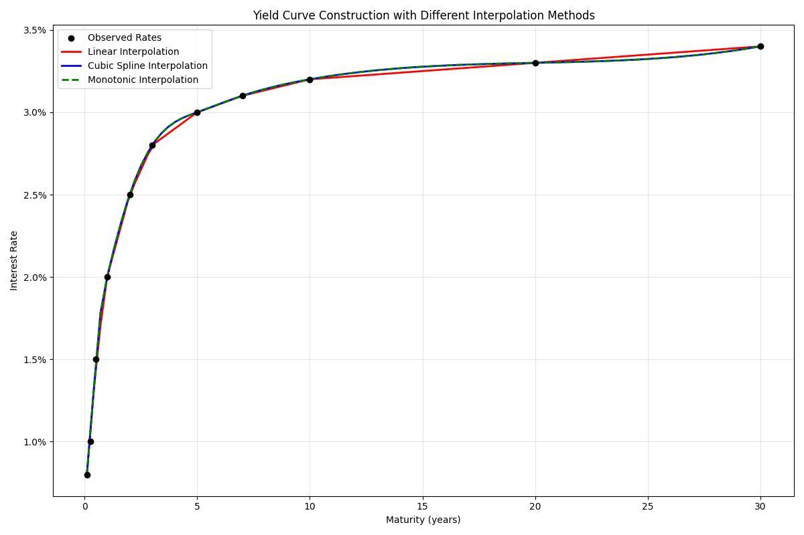
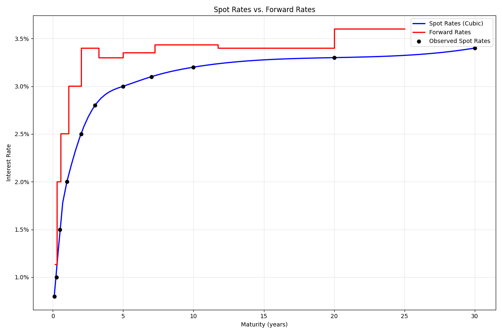
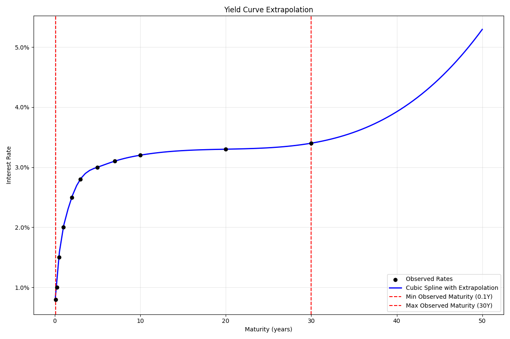

# Yield Curve Construction

The yield curve module provides functions for constructing and interpolating yield curves from market data. A yield curve represents the relationship between interest rates and maturities, which is essential for bond pricing, risk management, and economic analysis.

## Usage in Pypulate

```python
from pypulate.asset import construct_yield_curve, interpolate_rate

# Sample yield curve data
maturities = [0.1, 0.25, 0.5, 1, 2, 3, 5, 7, 10, 20, 30]  # in years
rates = [0.008, 0.01, 0.015, 0.02, 0.025, 0.028, 0.03, 0.031, 0.032, 0.033, 0.034]  # as decimals

# Construct a yield curve with cubic spline interpolation
yield_curve = construct_yield_curve(
    maturities=maturities,
    rates=rates,
    interpolation_method='cubic',
    extrapolate=False
)

# Interpolate rates at specific maturities
rate_4y = interpolate_rate(yield_curve, 4)
rate_15y = interpolate_rate(yield_curve, 15)

print(f"4-year rate: {rate_4y:.2%}")
print(f"15-year rate: {rate_15y:.2%}")

# Access forward rates
forward_rates = yield_curve['forward_rates']
for fr in forward_rates:
    print(f"Forward rate from {fr['start_maturity']}Y to {fr['end_maturity']}Y: {fr['forward_rate']:.2%}")

# Access curve characteristics
print(f"Yield curve steepness: {yield_curve['steepness']:.2%}")
print(f"Average rate: {yield_curve['average_rate']:.2%}")

# Check if maturity is within range before interpolating
min_maturity = yield_curve['min_maturity']
max_maturity = yield_curve['max_maturity']

maturity = 0.1  # The maturity you want to interpolate
if min_maturity <= maturity <= max_maturity:
    rate = interpolate_rate(yield_curve, maturity)
    print(f"{maturity}-year rate: {rate:.2%}")
else:
    print(f"Cannot interpolate at maturity {maturity} (outside range [{min_maturity}, {max_maturity}])")
```

## Functions

### construct_yield_curve

#### Parameters

| Parameter | Type | Description | Default |
|-----------|------|-------------|---------|
| `maturities` | list of float | Maturities in years for the observed rates | Required |
| `rates` | list of float | Observed interest rates (as decimals) | Required |
| `interpolation_method` | str | Method for interpolation ('linear', 'cubic', 'monotonic') | 'cubic' |
| `extrapolate` | bool | Whether to allow extrapolation beyond observed maturities | False |

#### Return Value

The `construct_yield_curve` function returns a dictionary with the following keys:

| Key | Type | Description |
|-----|------|-------------|
| `maturities` | list of float | Input maturities |
| `rates` | list of float | Input rates |
| `interpolation_method` | str | Method used for interpolation |
| `extrapolate` | bool | Whether extrapolation is allowed |
| `interpolate_func` | callable | Function that takes a maturity and returns the interpolated rate |
| `min_maturity` | float | Minimum maturity in the input data |
| `max_maturity` | float | Maximum maturity in the input data |
| `steepness` | float | Steepness of the yield curve (long-term rate minus short-term rate) |
| `average_rate` | float | Average of the input rates |
| `forward_rates` | list of dict | Implied forward rates between consecutive maturities |

Each element in the `forward_rates` list is a dictionary with the following keys:
- `start_maturity`: Starting maturity for the forward rate
- `end_maturity`: Ending maturity for the forward rate
- `forward_rate`: Implied forward rate for the period

### interpolate_rate

#### Parameters

| Parameter | Type | Description | Default |
|-----------|------|-------------|---------|
| `yield_curve` | dict | Yield curve object from `construct_yield_curve` | Required |
| `maturity` | float | Maturity in years for which to interpolate the rate | Required |

#### Return Value

The `interpolate_rate` function returns a float representing the interpolated interest rate at the specified maturity.

## Interpolation Methods

The `construct_yield_curve` function supports three interpolation methods:

| Method | Description | Best Used For |
|--------|-------------|--------------|
| `linear` | Simple linear interpolation between points | Quick approximations, when simplicity is preferred |
| `cubic` | Cubic spline interpolation with smooth derivatives | Most yield curves, provides smooth transitions |
| `monotonic` | Monotonic cubic interpolation (PCHIP) | When preserving monotonicity is important |

## Comprehensive Example

Here's a complete example demonstrating how to construct yield curves with different interpolation methods and visualize the results:

```python
import numpy as np
import matplotlib.pyplot as plt
from pypulate.asset import construct_yield_curve, interpolate_rate

# Sample yield curve data (US Treasury yields as of a sample date)
maturities = [0.1, 0.25, 0.5, 1, 2, 3, 5, 7, 10, 20, 30]
rates = [0.008, 0.01, 0.015, 0.02, 0.025, 0.028, 0.03, 0.031, 0.032, 0.033, 0.034]

# Construct yield curves with different interpolation methods
linear_curve = construct_yield_curve(maturities, rates, interpolation_method='linear')
cubic_curve = construct_yield_curve(maturities, rates, interpolation_method='cubic')
monotonic_curve = construct_yield_curve(maturities, rates, interpolation_method='monotonic')

# Create a dense set of maturities for smooth curve plotting
# Ensure we don't go below the minimum observed maturity
min_maturity = min(maturities)
max_maturity = max(maturities)
dense_maturities = np.linspace(min_maturity, max_maturity, 100)

# Get interpolated rates for each method
linear_rates = [interpolate_rate(linear_curve, t) for t in dense_maturities]
cubic_rates = [interpolate_rate(cubic_curve, t) for t in dense_maturities]
monotonic_rates = [interpolate_rate(monotonic_curve, t) for t in dense_maturities]

# Plot the results
plt.figure(figsize=(12, 8))

# Plot the actual data points
plt.scatter(maturities, rates, color='black', label='Observed Rates', zorder=3)

# Plot the interpolated curves
plt.plot(dense_maturities, linear_rates, 'r-', label='Linear Interpolation', linewidth=2)
plt.plot(dense_maturities, cubic_rates, 'b-', label='Cubic Spline Interpolation', linewidth=2)
plt.plot(dense_maturities, monotonic_rates, 'g--', label='Monotonic Interpolation', linewidth=2)

# Add labels and title
plt.xlabel('Maturity (years)')
plt.ylabel('Interest Rate')
plt.title('Yield Curve Construction with Different Interpolation Methods')
plt.grid(True, alpha=0.3)
plt.legend()

# Format y-axis as percentage
plt.gca().yaxis.set_major_formatter(plt.FuncFormatter(lambda x, _: f'{x:.1%}'))

plt.tight_layout()
plt.show()

# Calculate and plot forward rates
plt.figure(figsize=(12, 8))

# Extract forward rates
forward_maturities = [(fr['start_maturity'] + fr['end_maturity']) / 2 for fr in cubic_curve['forward_rates']]
forward_rates_values = [fr['forward_rate'] for fr in cubic_curve['forward_rates']]

# Plot spot rates and forward rates
plt.plot(dense_maturities, cubic_rates, 'b-', label='Spot Rates (Cubic)', linewidth=2)
plt.step(forward_maturities, forward_rates_values, 'r-', label='Forward Rates', linewidth=2, where='mid')
plt.scatter(maturities, rates, color='black', label='Observed Spot Rates', zorder=3)

plt.xlabel('Maturity (years)')
plt.ylabel('Interest Rate')
plt.title('Spot Rates vs. Forward Rates')
plt.grid(True, alpha=0.3)
plt.legend()
plt.gca().yaxis.set_major_formatter(plt.FuncFormatter(lambda x, _: f'{x:.1%}'))

plt.tight_layout()
plt.show()

# Demonstrate extrapolation
# Create a yield curve that allows extrapolation
extrapolating_curve = construct_yield_curve(maturities, rates, interpolation_method='cubic', extrapolate=True)
non_extrapolating_curve = construct_yield_curve(maturities, rates, interpolation_method='cubic', extrapolate=False)

# Create extended maturities for extrapolation demonstration
# Extend beyond the observed range (both shorter and longer maturities)
extended_maturities = np.linspace(0.05, 50, 100)

# Get interpolated/extrapolated rates with proper error handling
extrapolated_rates = []
for t in extended_maturities:
    try:
        # Try to get the rate, which will work for the extrapolating curve
        rate = interpolate_rate(extrapolating_curve, t)
        extrapolated_rates.append(rate)
    except ValueError:
        # If extrapolation is not allowed and we're outside the range, use NaN
        extrapolated_rates.append(np.nan)

# Plot extrapolation
plt.figure(figsize=(12, 8))

plt.scatter(maturities, rates, color='black', label='Observed Rates', zorder=3)
plt.plot(extended_maturities, extrapolated_rates, 'b-', label='Cubic Spline with Extrapolation', linewidth=2)

# Add vertical lines at the minimum and maximum observed maturities
plt.axvline(x=min_maturity, color='r', linestyle='--', label=f'Min Observed Maturity ({min_maturity}Y)')
plt.axvline(x=max_maturity, color='r', linestyle='--', label=f'Max Observed Maturity ({max_maturity}Y)')

plt.xlabel('Maturity (years)')
plt.ylabel('Interest Rate')
plt.title('Yield Curve Extrapolation')
plt.grid(True, alpha=0.3)
plt.legend()
plt.gca().yaxis.set_major_formatter(plt.FuncFormatter(lambda x, _: f'{x:.1%}'))

plt.tight_layout()
plt.show()

# Calculate discount factors from the yield curve
def calculate_discount_factors(yield_curve, maturities):
    discount_factors = []
    for t in maturities:
        # Only calculate for maturities within the valid range
        if yield_curve['min_maturity'] <= t <= yield_curve['max_maturity']:
            rate = interpolate_rate(yield_curve, t)
            discount_factor = 1 / (1 + rate) ** t
            discount_factors.append((t, discount_factor))
    return discount_factors

# Calculate discount factors for the cubic yield curve
discount_factors = calculate_discount_factors(cubic_curve, dense_maturities)
discount_maturities = [df[0] for df in discount_factors]
discount_values = [df[1] for df in discount_factors]

# Plot discount factors
plt.figure(figsize=(12, 8))

plt.plot(discount_maturities, discount_values, 'g-', linewidth=2)
plt.xlabel('Maturity (years)')
plt.ylabel('Discount Factor')
plt.title('Discount Factors Derived from the Yield Curve')
plt.grid(True, alpha=0.3)

plt.tight_layout()
plt.show()

# Example of safely handling extrapolation
def safe_interpolate(yield_curve, maturity):
    """Safely interpolate a rate, handling out-of-range maturities."""
    min_maturity = yield_curve['min_maturity']
    max_maturity = yield_curve['max_maturity']
    
    if min_maturity <= maturity <= max_maturity:
        return interpolate_rate(yield_curve, maturity)
    elif yield_curve['extrapolate']:
        # Extrapolation is allowed, but we'll print a warning
        rate = interpolate_rate(yield_curve, maturity)
        print(f"Warning: Extrapolating at maturity {maturity}Y (outside [{min_maturity}Y, {max_maturity}Y])")
        return rate
    else:
        # Extrapolation not allowed, return None or raise an exception
        print(f"Cannot interpolate at maturity {maturity}Y (outside [{min_maturity}Y, {max_maturity}Y])")
        return None

# Example usage of safe interpolation
test_maturities = [0.05, 0.1, 1, 5, 30, 40]
for m in test_maturities:
    rate = safe_interpolate(cubic_curve, m)
    if rate is not None:
        print(f"{m}-year rate: {rate:.2%}")
```

## Example Output

```
4-year rate: 2.93%
15-year rate: 3.25%

Forward rate from 0.25Y to 0.5Y: 2.01%
Forward rate from 0.5Y to 1Y: 2.51%
Forward rate from 1Y to 2Y: 3.01%
Forward rate from 2Y to 3Y: 3.41%
Forward rate from 3Y to 5Y: 3.44%
Forward rate from 5Y to 7Y: 3.21%
Forward rate from 7Y to 10Y: 3.37%
Forward rate from 10Y to 20Y: 3.40%
Forward rate from 20Y to 30Y: 3.50%

Yield curve steepness: 2.40%
Average rate: 2.63%
```

## Visualizations

### Yield Curve Construction

This chart shows the observed yield curve data points and the interpolated curves using different methods (linear, cubic spline, and monotonic).




### Spot Rates vs. Forward Rates

This chart compares the spot rates (yield curve) with the implied forward rates between consecutive maturities.




### Yield Curve Extrapolation

This chart demonstrates how the yield curve can be extrapolated beyond the range of observed maturities when the `extrapolate` parameter is set to `True`.




### Discount Factors

This chart shows the discount factors derived from the yield curve, which are used for discounting future cash flows in bond pricing and other applications.

## Practical Applications

Yield curve construction and interpolation are used for:

1. **Bond Pricing**: Discounting cash flows at the appropriate spot rates
2. **Fixed Income Analysis**: Analyzing the term structure of interest rates
3. **Risk Management**: Calculating duration, convexity, and other risk measures
4. **Derivatives Pricing**: Valuing interest rate derivatives
5. **Economic Analysis**: Interpreting the shape of the yield curve as an economic indicator
6. **Monetary Policy**: Understanding the impact of central bank actions
7. **Portfolio Management**: Constructing fixed income portfolios with specific duration targets

## Limitations

1. **Interpolation Artifacts**: Different interpolation methods can produce different results, especially between observed data points
2. **Extrapolation Risk**: Extrapolating beyond the range of observed maturities can lead to unrealistic rates
3. **Data Quality**: The quality of the constructed yield curve depends on the quality and coverage of the input data
4. **Cubic Spline Oscillations**: Cubic spline interpolation can sometimes produce oscillations that don't reflect market expectations
5. **Forward Rate Calculation**: The calculation of forward rates assumes a specific compounding convention

## Extensions

1. **Zero-Coupon Yield Curve**: Converting coupon bond yields to zero-coupon yields
2. **Bootstrapping**: Building a yield curve from coupon-bearing instruments
3. **Parametric Models**: Using models like Nelson-Siegel or Svensson for smoother yield curves
4. **Real Yield Curves**: Constructing inflation-adjusted yield curves
5. **Multi-Currency Yield Curves**: Building and comparing yield curves across different currencies 